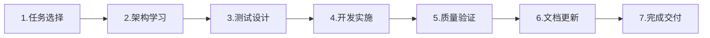

# AI Agent 导航地图

> **Harness Engineering**: "人类掌舵，Agent 执行"  
> **适用范围**: OPC-HARNESS 项目所有 AI Agent 和开发者  
> **最后更新**: 2026-03-24  

---

所有开发任务的执行必须严格遵循 [`Harness Engineering 流程`](./docs/HARNESS_ENGINEERING.md)。

## 🎯 快速入口（按优先级）

### ⭐⭐⭐ 必读核心
- [`Harness Engineering 流程`](./docs/HARNESS_ENGINEERING.md) - 7阶段标准开发流程
- [`src/AGENTS.md`](./src/AGENTS.md) - 前端开发规范（React + TypeScript）
- [`src-tauri/AGENTS.md`](./src-tauri/AGENTS.md) - Rust 后端规范

### ⭐⭐ 架构与约束
- [`ARCHITECTURE.md`](./ARCHITECTURE.md) - 系统架构设计
- [`docs/references/architecture-rules.md`](./docs/references/architecture-rules.md) - 架构约束（FE/BE/TEST）
- [`e2e/app.spec.ts`](./e2e/app.spec.ts) - E2E 测试示例 🔥

### ⭐ 测试与验证
```bash
npm run harness:check      # 架构健康检查（目标 100/100）
```

---

## 🏗️ 三大支柱

### 1. 上下文工程
**披露层级**: AGENTS.md → 模块 AGENTS.md → docs/

**关键文档**:
- `docs/design-docs/` - 技术决策记录
- `docs/exec-plans/active/MVP 版本规划.md` - 执行计划和进度

### 2. 架构约束
**数据流规则**:
```typescript
// ✅ 允许
Component → Hook → Store → Commands → Services → DB

// ❌ 禁止
Store → Component    // 状态层不可依赖 UI 层
Services → Commands  // 服务层不可依赖命令层
DB → Services        // 数据库层不可依赖数据层
```

**测试约束** 🔥:
- TEST-001: 所有功能必须单元测试覆盖（≥70%）
- TEST-002: 核心流程必须 E2E 测试覆盖
- TEST-003: 测试先行（TDD）
- TEST-004: E2E 测试独立（Mock 数据）
- TEST-005: 覆盖率不达标禁止合并

### 3. 反馈回路
**自动化检查**:
```bash
npm run harness:check          # 提交前必跑（完整验证）
npm run harness:fix            # 自动修复格式问题
```

**质量门禁**:
- ✅ TypeScript 编译通过
- ✅ ESLint 无错误
- ✅ Prettier 格式化一致
- ✅ Rust cargo check 通过
- ✅ 单元测试≥70% 🔥
- ✅ E2E 测试 100% 通过 🔥
- ✅ Health Score = 100/100

---

## 🚀 7 阶段开发流程 🔥



**详细说明**: 详见 **[Harness Engineering 流程](./docs/HARNESS_ENGINEERING.md)**

**快速参考**:
1. **任务选择**: 查阅 [MVP 版本规划](./docs/exec-plans/active/MVP 版本规划.md)，选 P0/P1
2. **架构学习**: 阅读 [架构规则](./docs/references/architecture-rules.md)
3. **测试设计**: 先写单元测试 + E2E 测试
4. **开发实施**: Rust 后端 + TS 前端，遵守分层约束
5. **质量验证**: `npm run harness:check`（目标 100/100）
6. **文档更新**: 标记任务完成，创建报告
7. **完成交付**: Git 提交，Health Score ≥90

---

## 📁 文档结构

```
Level 1: AGENTS.md (本文件)     ← 导航地图
    ↓
Level 2: src/AGENTS.md          ← 模块规范
    ↓
Level 3: docs/*                 ← 详细设计
```

**目录组织**:
- `docs/design-docs/` - 技术方案
- `docs/exec-plans/` - 执行计划
- `docs/product-specs/` - 产品需求
- `docs/references/` - 参考资料
- `docs/generated/` - 自动生成

---

## 🔧 命令速查

### 日常开发

```bash
# 测试流程
npm run harness:check          # 架构检查（完整验证）
npm run harness:fix            # 自动修复
npm run test:e2e               # E2E 测试
```

### 提交前验证
```bash
# 完整验证（默认，包含文档和死代码检测）
npm run harness:check
```

---

## 📊 质量门禁

| 检查项 | 满分 | 通过标准 |
|--------|------|---------|
| TypeScript 类型 | 20 | 编译通过 |
| ESLint 规范 | 15 | 无错误 |
| Prettier 格式 | 10 | 统一 |
| Rust 编译 | 25 | cargo check 通过 |
| **单元测试** 🔥 | 20 | **≥70%** |
| **E2E 测试** 🔥 | 10 | **100% 通过** |

**评分**: 90-100 优秀 ✨ | 70-89 良好 👍 | <70 需修复 ⚠️

---

## 🎓 学习路径

### 新手入门（1 小时）
1. 阅读本文件（10 分钟）
2. 精读 [Harness Engineering 流程](./docs/HARNESS_ENGINEERING.md)（20 分钟）
3. 浏览对应模块 AGENTS.md（20 分钟）
4. 运行 `npm run harness:check`（10 分钟）

### 进阶实战
1. 完成一个小功能（遵循 7 阶段）
2. 编写单元测试 + E2E 测试
3. 通过 Harness 验证（100/100）

---

## ❓ 常见问题

**Q: Harness Engineering 是什么？**  
A: AI 协作工程实践体系，核心理念"质量内建，非事后检查"。

**Q: 为什么需要 E2E 测试？** 🔥  
A: 提供端到端验证，防止回归 bug，确保核心流程可用。

**Q: Health Score 如何计算？**  
A: 基于 6 项核心检查，额外加分：单元测试 (+10)、E2E 测试 (+10)。目标 100/100。

**Q: 测试覆盖率不达标怎么办？**  
A: 补充边界条件和错误处理测试，达标前禁止合并（TEST-005）。

---

**维护者**: OPC-HARNESS Team  
**版本**: 4.0.0 (精简导航版)  
**最后更新**: 2026-03-24  
**变更说明**: 
- ✅ 精简至<100 行，聚焦导航功能
- ✅ 移除冗余细节，指向详细文档
- ✅ 强化智能导航，非百科全书
- ✅ 保留核心链接和快速参考
