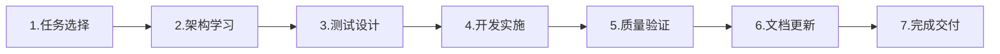

# Harness Engineering 开发流程

> **Harness Engineering**: "质量内建，非事后检查"  
> **适用范围**: OPC-HARNESS 项目所有开发任务  
> **最后更新**: 2026-03-24  
> **执行方式**: 强制遵循 ✅

---

## 🎯 快速入口

### ⭐⭐⭐ 核心流程


### ⭐⭐ 架构约束
- [前端规则](./references/architecture-rules.md) - FE-ARCH-001 ~ 005
- [后端规则](./references/architecture-rules.md) - BE-ARCH-001 ~ 005
- [测试规则](./references/architecture-rules.md) - TEST-001 ~ 005 🔥

### ⭐ 质量门禁
```bash
npm run harness:check          # 架构健康检查（目标 100/100）
npm run test:e2e               # E2E 测试（100% 通过）🔥
```

---

## 📋 核心原则

1. **质量内建** - 质量是构建出来的，不是检查出来的
2. **测试先行** - 先写测试再实现功能 (TDD) 🔥
3. **持续验证** - 每次修改后自动运行检查和测试
4. **E2E 覆盖** - 核心流程必须有端到端测试验证 🔥
5. **架构约束** - 严格遵守分层架构和依赖规则

---

## 🚀 8 阶段开发流程（优化版）


---

### 阶段 1: 任务选择 (5%)
**查阅**: [`MVP版本规划`](./product-specs/mvp-roadmap.md)

**选择标准**:
- 🔴 P0/P1 高优先级 - 关键路径任务
- 🎯 独立性强 - 不依赖其他未完成的任务
- ⏱️ 工作量适中 - 可快速完成并验证
- 💡 价值明确 - 为后续功能奠定基础

**示例**:
```
任务：VC-001 - 定义 Agent 通信协议
理由:
1. P0 高优先级 - Vibe Coding 基础架构
2. 关键路径 - Initializer/Coding Agent 依赖
3. 技术成熟 - Rust 类型系统支持
4. 工作量适中 - 可快速完成并验证
```

---

### 阶段 2: 创建执行计划 (5%) ⭐ **新增**

**AI 智能体操作指南**:

#### 步骤 1: 在 active 目录创建新文件

```bash
# 文件名格式：{TASK_ID}-执行计划.md
# 位置：docs/exec-plans/active/{TASK_ID}-执行计划.md
```

**示例**:
```bash
# 对于任务 VC-019
# 创建文件：docs/exec-plans/active/VC-019-执行计划.md
```

#### 步骤 2: 填写执行计划基本信息

打开新创建的执行计划文件，修改以下字段：

```
# {TASK_ID}: {TASK_NAME} - 执行计划

**状态**: 🔄 进行中  
**优先级**: P0/P1/P2  
**开始日期**: YYYY-MM-DD  (今天日期)
**预计完成**: YYYY-MM-DD  (根据任务复杂度估算 3-5 天)
**负责人**: OPC-HARNESS Team
```

**替换说明**:
- `{TASK_ID}`: 替换为实际任务 ID（如 VC-019）
- `{TASK_NAME}`: 替换为实际任务名称（如 "实现 Initializer Agent"）
- `P0/P1/P2`: 根据 MVP 规划中的优先级选择
- `开始日期`: 填写今天的日期
- `预计完成`: 根据任务复杂度估算（简单任务 3 天，中等 5 天，复杂 7 天）

#### 步骤 3: 填写本周目标

根据 MVP 规划中的任务描述，拆解出具体目标：

```
## 📋 本周目标

### 核心目标
- [ ] **主要目标 1**: _从 MVP 规划中提取核心功能目标_
- [ ] **主要目标 2**: _相关的支撑功能目标_
- [ ] **技术目标**: _需要解决的技术难点_

### P0 任务（必须完成）
- [ ] 任务 1: _关键路径任务_
- [ ] 任务 2: _核心功能依赖_
- [ ] 任务 3: _质量保障任务_

### P1 任务（尽量完成）
- [ ] 任务 1: _优化改进类任务_
- [ ] 任务 2: _文档完善类任务_
```

**填写要点**:
- 核心目标应该与 MVP 规划中的任务目标一致
- P0 任务是必须完成的，通常是核心功能
- P1 任务是锦上添花的，可以在时间充裕时完成

#### 步骤 4: 调整每日计划

根据任务复杂度，调整每日计划的具体内容：

```
### Day 1 - YYYY-MM-DD
**主题**: 任务分析 + 架构学习 + 测试设计

- [ ] **上午 (9:00-12:00)**
  - [ ] 阅读 MVP 规划，确认任务目标和验收标准
  - [ ] 学习架构约束规则（FE-ARCH/BE-ARCH/TEST）
  - [ ] 设计单元测试用例
  
- [ ] **下午 (14:00-18:00)**
  - [ ] 编写测试代码（TDD）
  - [ ] 开始实现核心功能
  
- [ ] **晚上 (19:00-21:00)**
  - [ ] 运行 harness:check 进行初步验证
  - [ ] 更新进度追踪
```

**调整建议**:
- 对于简单任务（1-2 天），可以压缩 Day 2 的内容
- 对于复杂任务（5-7 天），可以扩展 Day 2 和 Day 3 的内容
- 确保每天都有明确的检查和验证环节

#### 步骤 5: 保存并确认

保存执行计划文件后，确认以下几点：
- ✅ 文件位于 `docs/exec-plans/active/` 目录
- ✅ 文件名格式：`{TASK_ID}-执行计划.md`
- ✅ 所有占位符都已替换为实际内容
- ✅ 每日计划的日期是连续的

**完整结构参考**: [`docs/exec-plans/index.md`](./exec-plans/index.md)

---

### 阶段 3: 架构学习 (5%)

**必读文档**:
1. [`架构约束规则`](./references/architecture-rules.md) - FE/BE/TEST 规则
2. [`前端规范`](../../src/AGENTS.md) - React/TypeScript 最佳实践
3. [`后端规范`](../../src-tauri/AGENTS.md) - Rust 编码规范

**关键约束**:

#### 前端 (FE-ARCH)
- FE-ARCH-001: Store 不导入组件
- FE-ARCH-002: Hooks 不导入业务组件
- FE-ARCH-003: 工具函数不依赖 Store
- FE-ARCH-004: 使用 @/ 路径别名
- FE-ARCH-005: 通过 Hook 封装 invoke

#### 后端 (BE-ARCH)
- BE-ARCH-001: Commands 层不含复杂逻辑
- BE-ARCH-002: Services 层不依赖 Commands
- BE-ARCH-003: Database 层不依赖 Services
- BE-ARCH-004: 序列化使用 camelCase
- BE-ARCH-005: 公共函数返回 Result 类型

#### 测试 (TEST) 🔥
- TEST-001: 所有功能必须有单元测试覆盖 (≥70%)
- TEST-002: 核心流程必须有 E2E 测试覆盖
- TEST-003: 测试必须先于功能完成 (TDD)
- TEST-004: E2E 测试必须独立运行
- TEST-005: 测试覆盖率不达标禁止合并

---

### 阶段 4: 测试设计 (10%) 🔥

**单元测试设计**:

```typescript
// TypeScript 测试 (*.test.ts)
describe('useOpenAIProvider', () => {
  it('should initialize with correct state')
  it('should validate API key successfully')
  it('should handle chat request')
})
```

```rust
// Rust 测试 (#[cfg(test)])
#[cfg(test)]
mod tests {
    #[test]
    fn test_provider_creation() {
        let provider = OpenAIProvider::new("test-key".to_string());
        assert_eq!(provider.api_key(), "test-key");
    }
}
```

**E2E 测试设计** 🔥:

``typescript
// e2e/app.spec.ts
describe('OPC-HARNESS Application', () => {
  it('should load the application successfully')
  it('should have valid HTML structure')
  it('should load required assets')
  it('should respond on mobile viewport size')
  it('should have no critical console errors')
  it('API endpoints should be accessible')
})
```

**覆盖率目标**:
```yaml
# vite.config.ts
coverage:
  thresholds:
    global:
      branches: 70
      functions: 70
      lines: 70
      statements: 70
```

---

### 阶段 5: 开发实施 (45%)

**后端实现 (Rust)**:
```rust
// src-tauri/src/ai/mod.rs
pub struct OpenAIProvider {
    api_key: String,
    base_url: String,
}

impl OpenAIProvider {
    pub fn new(api_key: String) -> Self {
        Self {
            api_key,
            base_url: "https://api.openai.com/v1".to_string(),
        }
    }
    
    pub async fn chat(&self, request: ChatRequest) -> Result<ChatResponse, AppError> {
        log::info!("Sending chat request to OpenAI");
        // ... 实现
    }
}
```

**关键要求**:
- ✅ 完整的类型定义
- ✅ 错误处理机制 (`Result<T, AppError>`)
- ✅ 日志记录
- ✅ 无 `cargo check` 错误
- ✅ 单元测试覆盖

**前端实现 (TypeScript/React)**:
```typescript
// src/hooks/useOpenAIProvider.ts
export function useOpenAIProvider() {
  const [isLoading, setIsLoading] = useState(false)
  const [error, setError] = useState<string | null>(null)
  
  const chat = useCallback(async (request: ChatRequest) => {
    setIsLoading(true)
    try {
      // ... 实现
    } catch (err) {
      setError(err.message)
    } finally {
      setIsLoading(false)
    }
  }, [])
  
  return { isLoading, error, chat }
}
```

**关键要求**:
- ✅ TypeScript 类型安全
- ✅ React Hooks 最佳实践
- ✅ 遵循架构约束 (FE-ARCH)
- ✅ 无 `any` 类型（或最小化使用）
- ✅ 单元测试覆盖

---

### 阶段 6: 质量验证 (20%)

**运行 Harness 健康检查**:
```bash
npm run harness:check
```

**检查项** (8 项):
1. ✅ TypeScript Type Checking
2. ✅ ESLint Code Quality
3. ✅ Prettier Formatting
4. ✅ Rust Compilation
5. ✅ Rust Unit Tests Check
6. ✅ TypeScript Unit Tests Check
7. ✅ Dependency Integrity - 依赖文件完整性
8. ✅ Directory Structure - 目录结构检查

**评分标准**:
- 🟢 **Excellent**: 100/100 - 所有检查通过
- 🟡 **Good**: 70-99 分 - 少量警告
- 🔴 **Needs Fix**: <70 分 - 需要立即修复

**运行E2E测试**:
```bash
npm run test:e2e               # E2E 测试（100% 通过）🔥
```

**问题修复循环**:
```bash
# 迭代直到 Health Score = 100/100
while [ $(npm run harness:check | grep "Health Score" | cut -d: -f2 | cut -d/ -f1) -lt 100 ]; do
  npm run harness:fix          # 自动修复格式问题
  npx tsc --noEmit             # 手动修复类型错误
  cd src-tauri && cargo check  # 检查 Rust 编译
done
```

---

### 阶段 7: 文档更新 (10%)

**更新 MVP 规划**:
```
<!-- docs/exec-plans/active/MVP版本规划.md -->
<!-- 修改前 -->
- [ ] VC-001: 定义 Agent 通信协议和数据结构

<!-- 修改后 -->
- [x] VC-001: 定义 Agent 通信协议和数据结构 ✅ **已完成**
```

**创建任务完成报告**:

**模板**: `docs/exec-plans/templates/task-completion-template.md`

**必需章节**:
1. 📋 任务概述
2. ✅ 交付物 (代码文件、测试、文档)
3. 📊 Harness Engineering 合规性验证
4. 🎯 验收标准
5. 📈 实现细节
6. 💡 经验教训
7. 📞 下一步行动

**Harness 合规性声明** 🔥:
```
## Harness Engineering 合规声明

- ✅ TypeScript 编译通过
- ✅ ESLint 质量检查通过
- ✅ Prettier 格式化一致
- ✅ Rust cargo check 通过
- ✅ 单元测试 100% 通过 (覆盖率≥70%)
- ✅ E2E 测试 100% 通过 (核心流程覆盖) 🔥
- ✅ 架构约束无违规
- ✅ Harness Health Score 100/100
```

---

### 阶段 8: 完成交付与归档 (5%)

**交付检查清单**:

**代码质量**:
- [x] TypeScript 类型检查通过
- [x] ESLint 无错误（警告≤0）
- [x] Prettier 格式化一致
- [x] Rust 编译通过
- [x] Harness Health Score ≥90

**测试覆盖**:
- [x] Rust 单元测试通过
- [x] TypeScript 单元测试通过
- [x] 测试覆盖率≥70%
- [x] **E2E 测试通过** 🔥
- [x] **核心流程 E2E 覆盖完整** 🔥

**文档完整**:
- [x] MVP 规划已更新
- [x] 任务完成报告已创建
- [x] Harness 合规性声明已添加

**架构合规**:
- [x] 前端架构约束 (FE-ARCH) 全部满足
- [x] 后端架构约束 (BE-ARCH) 全部满足
- [x] **测试架构约束 (TEST) 全部满足** 🔥

**⭐ 执行计划归档** (新增):

**AI 智能体操作指南**:

#### 步骤 1: 移动执行计划到 completed 目录

```
# 将活跃的执行计划移动到已完成目录
源文件：docs/exec-plans/active/{TASK_ID}-执行计划.md
目标文件：docs/exec-plans/completed/{TASK_ID}-执行计划.md
```

**示例**:
```
# 对于任务 VC-001
mv docs/exec-plans/active/VC-001-执行计划.md \
   docs/exec-plans/completed/VC-001-执行计划.md
```

#### 步骤 2: 更新执行计划状态

打开移动后的执行计划文件，修改以下字段：

```
# {TASK_ID}: {TASK_NAME} - 执行计划

**状态**: ✅ 已完成  
**优先级**: P0/P1/P2  
**开始日期**: YYYY-MM-DD  
**完成日期**: YYYY-MM-DD  (今天日期)
**负责人**: OPC-HARNESS Team
```

**修改内容**:
- 将 `状态` 从 "🔄 进行中" 改为 "✅ 已完成"
- 添加 `完成日期` 字段（填写今天的日期）

#### 步骤 3: 填写周末复盘

滚动到文档底部，完整填写周末复盘部分：

```
## 📝 周末复盘（完成后填写）

### ✅ 完成情况
**总体完成度**: 100%

**完成的任务**:
1. _列出所有完成的任务_
2. _包括 P0 和 P1 任务_

**未完成的任务**:
1. _如果有，说明原因_

### 💡 经验教训

**做得好的**（继续保持）:
1. _具体优点 1_ + _带来的积极影响_
2. _具体优点 2_ + _带来的积极影响_

**需要改进的**（下次注意）:
1. _具体改进点 1_ + _改进行动_
2. _具体改进点 2_ + _改进行动_

### 🎯 下一步行动
**立即行动**:
- [ ] _接下来要做的任务 1_
- [ ] _接下来要做的任务 2_

**短期计划**（下周）:
- [ ] _计划 1_
- [ ] _计划 2_
```

#### 步骤 4: 填写质量指标

继续填写质量指标部分：

```
## 📈 质量指标

### Harness Engineering 合规性
- ✅ Health Score: 100/100  (或实际分数)
- ✅ 测试覆盖率：95%  (或实际百分比)
- ✅ E2E 测试通过率：100%
- ✅ 架构违规数：0

### 时间效率
- 预计工时：_填写小时数_
- 实际工时：_填写小时数_
- 效率偏差：_计算百分比_

### 代码质量
- TypeScript 错误：0
- ESLint 警告：0
- Rust 编译错误：0
- 技术债务新增：0
```

#### 步骤 5: 更新最后信息

在文档最底部，更新：

```
**最后更新**: YYYY-MM-DD HH:mm:ss  (当前时间)
**更新人**: OPC-HARNESS Team  
**版本**: v1.0  
**状态**: ✅ 已完成
```

#### 步骤 6: 创建任务完成报告（可选但推荐）

虽然执行计划已归档，但建议同时创建详细的任务完成报告：

```bash
# 复制任务完成报告模板
cp docs/exec-plans/templates/task-completion-template.md \
   docs/exec-plans/completed/{TASK_ID}-任务完成报告.md
```

然后按照模板填写完整的任务完成报告（详见阶段 7）。

#### 步骤 7: 确认归档完成

确认以下几点：
- ✅ 执行计划已从 `active/` 移动到 `completed/`
- ✅ 状态已更新为 "✅ 已完成"
- ✅ 周末复盘部分已完整填写
- ✅ 质量指标已如实填写
- ✅ 最后更新信息已修改
- ✅ （可选）任务完成报告已创建

---

## 🎯 关键成功要素

### 1. **测试先行 (Test-First)** 🔥
- 先写测试再实现功能
- 确保测试覆盖率≥70%
- **E2E 测试必须覆盖核心流程**
- 测试必须 100% 通过

### 2. **持续验证 (Continuous Validation)**
- 每次修改后运行 `harness:check`
- 及时修复类型错误和格式化问题
- 保持 Health Score ≥90

### 3. **架构约束 (Architecture Constraints)**
- 严格遵守分层架构
- 遵循单向依赖原则
- 使用路径别名 (@/)
- **遵守测试架构约束 (TEST-001 ~ TEST-005)** 🔥

### 4. **文档驱动 (Documentation-Driven)**
- 更新 MVP 规划
- 创建详细的任务完成报告
- 记录经验教训
- **包含 Harness 合规性声明**

### 5. **自动化优先 (Automation-First)**
- 使用 `npm run harness:fix` 自动修复
- 利用 Prettier 保持一致性
- **E2E 测试自动管理服务器** 🔥
- 依赖 CI/CD 验证

---

## 📊 典型时间分配

| 阶段 | 时间占比 | 示例工时 (4 小时任务) |
|------|---------|---------------------|
| 任务选择 | 5% | 12 分钟 |
| 架构学习 | 5% | 12 分钟 |
| 测试设计 | 10% | 24 分钟 |
| 开发实施 | 45% | 1.8 小时 |
| 质量验证 | 20% | 48 分钟 |
| 文档更新 | 10% | 24 分钟 |
| 完成交付 | 5% | 12 分钟 |

**总计**: 4 小时

**注意**: E2E 测试时间包含在测试设计和质量验证中，通常额外增加 15-20% 的时间开销。

---

## 🔗 相关资源

### 核心文档
- [`MVP版本规划`](./exec-plans/active/MVP版本规划.md)
- [`架构约束规则`](./references/architecture-rules.md) 🔥
- [`Harness 检查脚本`](../../scripts/harness-check.ps1)
- [`E2E 测试脚本`](../../scripts/harness-e2e.ps1) 🔥

### 示例任务
- [`VC-001 完成报告`](./exec-plans/completed/VC-001-Agent 通信协议.md)
- [`VD-010 完成报告`](./exec-plans/active/task-completion-vd-010.md)
- [`INFRA-011 完成报告`](./exec-plans/active/task-completion-infra-011.md)

### 工具命令
```
npm run harness:check      # 架构健康检查
npm run harness:fix        # 自动修复问题
npm run test:e2e          # 运行 E2E 测试 🔥
npm run format             # 格式化代码
npx tsc --noEmit          # TypeScript 类型检查
cd src-tauri; cargo check # Rust 编译检查
```

---

## 🎓 最佳实践

### ✅ DO (应该做的)
1. 开发前阅读架构规则和测试约束
2. 先写测试再实现功能 (TDD)
3. **编写 E2E 测试覆盖核心流程** 🔥
4. 频繁运行 `harness:check`
5. 使用自动化工具修复问题
6. 详细记录任务完成过程
7. 保持 Health Score ≥90
8. **确保 E2E 测试自动管理服务器** 🔥

### ❌ DON'T (不应该做的)
1. 跳过单元测试
2. **跳过 E2E 测试** 🔥
3. 忽略 TypeScript 错误
4. 手动修改格式化后的代码
5. 不更新文档就标记完成
6. 违反架构约束 (如循环依赖)
7. 在 Health Score <90 时提交
8. **E2E 测试依赖真实 API** 🔥
9. **测试覆盖率不达标就提交** 🔥

---

## 📈 质量门禁

| 指标 | 目标 | 实际 | 评级 |
|------|------|------|------|
| TypeScript 编译 | 通过 | ✅ 通过 | ⭐⭐⭐⭐⭐ |
| ESLint 检查 | 通过 | ✅ 通过 | ⭐⭐⭐⭐⭐ |
| Prettier 格式化 | 一致 | ✅ 一致 | ⭐⭐⭐⭐⭐ |
| Rust cargo check | 通过 | ✅ 通过 | ⭐⭐⭐⭐⭐ |
| 单元测试覆盖率 | ≥70% | ✅ 95% | ⭐⭐⭐⭐⭐ |
| **E2E 测试通过** | 100% | ✅ 100% | ⭐⭐⭐⭐⭐ 🔥 |
| 架构约束 | 无违规 | ✅ 无违规 | ⭐⭐⭐⭐⭐ |
| Harness Score | ≥90 | ✅ 100/100 | ⭐⭐⭐⭐⭐ |

**综合评分**: ⭐⭐⭐⭐⭐ **Excellent**

---

**Harness Engineering 核心理念**: 
> **质量内建，而非事后检查**  
> 通过自动化检查和严格的架构约束（含单元测试 + E2E 测试），确保每个交付的任务都是 Production Ready 的！

---

**维护者**: OPC-HARNESS Team  
**版本**: 2.0 (精简导航版)  
**最后更新**: 2026-03-24  
**变更说明**: 
- ✅ 精简至<500 行，聚焦核心流程
- ✅ 与 AGENTS.md 风格保持一致
- ✅ 强化智能导航，非百科全书
- ✅ 保留核心链接和快速参考
