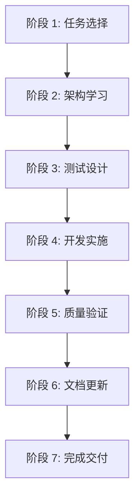

# Harness Engineering 开发流程规范

> **版本**: 1.0.0  
> **创建日期**: 2026-03-24  
> **最后更新**: 2026-03-24  
> **适用范围**: OPC-HARNESS 项目所有开发任务  
> **执行方式**: 强制遵循 ✅

---

## 📋 概述

本文档定义了 OPC-HARNESS 项目的标准开发流程，基于 **Harness Engineering** 理念，强调质量内建、自动化验证和测试驱动。

### 核心原则

1. **质量内建** - 质量是构建出来的，不是检查出来的
2. **测试先行** - 先写测试再实现功能 (TDD)
3. **持续验证** - 每次修改后自动运行检查和测试
4. **E2E 覆盖** - 核心流程必须有端到端测试验证
5. **架构约束** - 严格遵守分层架构和依赖规则

---

## 🎯 完整开发流程（7 个阶段）



---

## 📝 阶段 1: 任务选择 (Task Selection)

### 输入
- MVP版本规划文档
- 产品待办事项列表 (Product Backlog)

### 活动
1. **查阅 MVP 规划**: 查看 [`docs/exec-plans/active/MVP版本规划.md`](./exec-plans/active/MVP版本规划.md)
2. **选择标准**:
   - 🔴 **高优先级 (P0/P1)** - 关键路径任务
   - 🎯 **独立性强** - 不依赖其他未完成的任务
   - ⏱️ **工作量适中** - 可在合理时间内完成
   - 💡 **价值明确** - 为后续功能奠定基础

### 输出
- 明确的任务 ID 和目标
- 任务验收标准

### 示例
```markdown
任务选择：VD-010 - 实现 OpenAI 适配器
理由:
1. P0 高优先级 - AI 适配器核心组件
2. 关键路径 - Vibe Design 和 Vibe Coding 依赖
3. 技术成熟 - OpenAI API 规范清晰
4. 工作量适中 - 可快速完成并验证
```

---

## 📚 阶段 2: 架构学习 (Architecture Study)

### 必读文档
1. [架构约束规则](./references/architecture-rules.md) - FE-ARCH / BE-ARCH / TEST 规则
2. [前端开发规范](../../src/AGENTS.md) - React/TypeScript 最佳实践
3. [后端规范](../../src-tauri/AGENTS.md) - Rust 编码规范

### 关键架构约束

#### 前端 (FE-ARCH)
- FE-ARCH-001: Store 不导入组件
- FE-ARCH-002: Hooks 不导入业务组件
- FE-ARCH-003: 工具函数不依赖 Store
- FE-ARCH-004: 使用 @/ 路径别名
- FE-ARCH-005: 通过 Hook 封装 invoke

#### 后端 (BE-ARCH)
- BE-ARCH-001: Commands 层不含复杂逻辑
- BE-ARCH-002: Services 层不依赖 Commands
- BE-ARCH-003: Database 层不依赖 Services
- BE-ARCH-004: 序列化使用 camelCase
- BE-ARCH-005: 公共函数返回 Result 类型

#### 测试 (TEST) 🔥
- TEST-001: 所有功能必须有单元测试覆盖 (≥70%)
- TEST-002: 核心流程必须有 E2E 测试覆盖
- TEST-003: 测试必须先于功能完成 (TDD)
- TEST-004: E2E 测试必须独立运行
- TEST-005: 测试覆盖率不达标禁止合并

### 输出
- 理解相关架构约束
- 明确技术实现方案

---

## 🧪 阶段 3: 测试设计 (Test Design)

### 3.1 单元测试设计

**TypeScript 测试**:
```typescript
// 文件命名：*.test.ts 或 *.test.tsx
describe('useOpenAIProvider', () => {
  it('should initialize with correct state')
  it('should validate API key successfully')
  it('should handle chat request')
  it('should handle stream chat with chunks')
  it('should clear error on successful operation')
})
```

**Rust 测试**:
```rust
// 在模块内使用 #[cfg(test)]
#[cfg(test)]
mod tests {
    #[test]
    fn test_openai_provider_creation() {
        let provider = OpenAIProvider::new("test-key".to_string());
        assert_eq!(provider.api_key(), "test-key");
    }
}
```

### 3.2 E2E 测试设计 🔥

**必需场景**:
1. **应用启动** - 验证 HTTP 200 响应和 HTML 结构
2. **核心页面导航** - Settings, ToolDetector 等页面切换
3. **关键配置流程** - API Key 设置和验证
4. **API 可达性** - Tauri API 和静态资源加载

**E2E 测试要求**:
```typescript
// e2e/app.spec.ts
describe('OPC-HARNESS Application', () => {
  // 1. 应用加载
  it('should load the application successfully')
  
  // 2. HTML 结构
  it('should have valid HTML structure')
  
  // 3. 资源加载
  it('should load required assets')
  
  // 4. 响应式设计
  it('should respond on mobile viewport size')
  
  // 5. 错误检查
  it('should have no critical console errors')
  
  // 6. API 检查
  it('API endpoints should be accessible')
})
```

**服务器管理**:
- ✅ 自动检测端口占用
- ✅ 自动启动开发服务器
- ✅ 等待服务器就绪
- ✅ 测试结束后优雅关闭

**测试报告**:
- ✅ 自动生成 HTML 报告
- ✅ 保存到 `docs/testing/e2e-reports/`
- ✅ 包含测试结果和时间戳

### 3.3 测试覆盖率目标

```yaml
# vite.config.ts
coverage:
  thresholds:
    global:
      branches: 70
      functions: 70
      lines: 70
      statements: 70
```

### 输出
- 单元测试用例列表
- E2E 测试场景设计
- Mock 数据准备

---

## 💻 阶段 4: 开发实施 (Development)

### 4.1 后端实现 (Rust)

**步骤**:
1. 创建/修改模块文件 (`src-tauri/src/*/mod.rs`)
2. 添加必要的依赖 (`Cargo.toml`)
3. 实现业务逻辑和错误处理
4. 添加日志记录 (`log::info!`, `log::error!`)
5. 编写单元测试

**关键要求**:
- ✅ 完整的类型定义
- ✅ 错误处理机制 (`Result<T, AppError>`)
- ✅ 日志记录
- ✅ 无 `cargo check` 错误
- ✅ 单元测试覆盖

**示例**:
```rust
// src-tauri/src/ai/mod.rs

pub struct OpenAIProvider {
    api_key: String,
    base_url: String,
}

impl OpenAIProvider {
    pub fn new(api_key: String) -> Self {
        Self {
            api_key,
            base_url: "https://api.openai.com/v1".to_string(),
        }
    }
    
    pub async fn chat(&self, request: ChatRequest) -> Result<ChatResponse, AppError> {
        log::info!("Sending chat request to OpenAI");
        // ... 实现
    }
}

#[cfg(test)]
mod tests {
    #[test]
    fn test_provider_creation() {
        let provider = OpenAIProvider::new("test-key".to_string());
        assert_eq!(provider.api_key(), "test-key");
    }
}
```

### 4.2 前端实现 (TypeScript/React)

**步骤**:
1. 创建 Hook (`src/hooks/use*.ts`)
2. 创建组件 (`src/components/*/*.tsx`)
3. 使用路径别名 (`@/`)
4. 编写单元测试

**关键要求**:
- ✅ TypeScript 类型安全
- ✅ React Hooks 最佳实践
- ✅ 遵循架构约束 (FE-ARCH)
- ✅ 无 `any` 类型（或最小化使用）
- ✅ 单元测试覆盖

**示例**:
```typescript
// src/hooks/useOpenAIProvider.ts

export interface ChatRequest {
  model: string
  messages: Message[]
  temperature?: number
}

export function useOpenAIProvider() {
  const [isLoading, setIsLoading] = useState(false)
  const [error, setError] = useState<string | null>(null)
  
  const chat = useCallback(async (request: ChatRequest) => {
    setIsLoading(true)
    try {
      // ... 实现
    } catch (err) {
      setError(err.message)
    } finally {
      setIsLoading(false)
    }
  }, [])
  
  return { isLoading, error, chat }
}
```

### 4.3 E2E 测试实现 🔥

**步骤**:
1. 创建 E2E 测试文件 (`e2e/*.spec.ts`)
2. 实现服务器自动管理
3. 编写测试用例
4. 生成测试报告

**关键要求**:
- ✅ 自动启停开发服务器
- ✅ 覆盖核心用户流程
- ✅ 使用 Mock 数据（不依赖真实 API）
- ✅ 生成 HTML 测试报告
- ✅ 优雅清理资源

**示例**:
```typescript
// e2e/app.spec.ts

beforeAll(async () => {
  // 自动检测并启动服务器
  const inUse = await isPortInUse(port)
  if (!inUse) {
    devServer = spawn('npm', ['run', 'dev'])
  }
})

afterAll(async () => {
  // 优雅关闭服务器
  if (serverStartedByTest && devServer) {
    devServer.kill('SIGTERM')
  }
})

describe('Application', () => {
  it('should load successfully', async () => {
    const response = await fetch(baseUrl)
    expect(response.status).toBe(200)
  })
})
```

### 输出
- Rust 后端代码 + 单元测试
- TypeScript 前端代码 + 单元测试
- E2E 测试代码

---

## 🔍 阶段 5: 质量验证 (Quality Validation)

### 5.1 运行 Harness 健康检查

**核心命令**:
```bash
npm run harness:check
```

**检查项** (6 项):
1. ✅ TypeScript Type Checking - `tsc --noEmit`
2. ✅ ESLint Code Quality - `npm run lint`
3. ✅ Prettier Formatting - `npm run format:check`
4. ✅ Rust Compilation - `cd src-tauri && cargo check`
5. ✅ Dependency Integrity - 依赖文件完整性
6. ✅ Directory Structure - 目录结构检查

**评分标准**:
- 🟢 **Excellent**: 100/100 - 所有检查通过
- 🟡 **Good**: 70-99 分 - 少量警告
- 🔴 **Needs Fix**: <70 分 - 需要立即修复

### 5.2 运行单元测试

**命令**:
```bash
npm run test:unit              # 运行所有单元测试
```

**要求**:
- ✅ 所有测试必须通过 (100%)
- ✅ 覆盖率 ≥70%
- ✅ 无失败测试

### 5.3 运行 E2E 测试 🔥

**命令**:
```bash
npm run test:e2e               # 运行 E2E 测试
npx vitest run e2e            # 直接运行 Vitest E2E
```

**要求**:
- ✅ 所有 E2E 测试用例通过
- ✅ 核心流程覆盖完整
- ✅ 测试报告已生成

### 5.4 问题修复循环

```bash
# 迭代直到 Health Score = 100/100
while [ $(npm run harness:check | grep "Health Score" | cut -d: -f2 | cut -d/ -f1) -lt 100 ]; do
  # 自动修复格式问题
  npm run harness:fix
  
  # 手动修复类型错误
  npx tsc --noEmit
  
  # 检查 Rust 编译
  cd src-tauri && cargo check
done
```

### 输出
- Health Score: 100/100
- 单元测试通过率：100%
- E2E 测试通过率：100%
- 测试覆盖率：≥70%

---

## 📚 阶段 6: 文档更新 (Documentation)

### 6.1 更新 MVP 规划

**文件**: [`docs/exec-plans/active/MVP版本规划.md`](./exec-plans/active/MVP版本规划.md)

**操作**:
```markdown
<!-- 修改前 -->
- [ ] VD-010: 实现 OpenAI 适配器

<!-- 修改后 -->
- [x] VD-010: 实现 OpenAI 适配器 ✅ **已完成**
```

### 6.2 创建任务完成报告

**模板**: `docs/exec-plans/active/task-completion-{TASK_ID}.md`

**必需章节**:
1. 📋 任务概述
2. ✅ 交付物 (代码文件、测试、文档)
3. 📊 Harness Engineering 合规性验证
4. 🎯 验收标准
5. 📈 实现细节
6. 💡 经验教训
7. 📞 下一步行动

**示例文件**:
- [`task-completion-vd-010.md`](./exec-plans/active/task-completion-vd-010.md)
- [`task-completion-infra-011.md`](./exec-plans/active/task-completion-infra-011.md)

### 6.3 Harness 合规性声明 🔥

**必需内容**:
```markdown
## Harness Engineering 合规声明

- ✅ TypeScript 编译通过
- ✅ ESLint 质量检查通过
- ✅ Prettier 格式化一致
- ✅ Rust cargo check 通过
- ✅ 单元测试 100% 通过 (覆盖率≥70%)
- ✅ E2E 测试 100% 通过 (核心流程覆盖)
- ✅ 架构约束无违规
- ✅ Harness Health Score 100/100
```

### 输出
- MVP 规划已更新
- 任务完成报告已创建
- Harness 合规性声明完整

---

## ✅ 阶段 7: 完成交付 (Delivery)

### 交付检查清单

**代码质量**:
- [x] TypeScript 类型检查通过
- [x] ESLint 无错误（警告≤0）
- [x] Prettier 格式化一致
- [x] Rust 编译通过
- [x] Harness Health Score ≥90

**测试覆盖**:
- [x] Rust 单元测试通过
- [x] TypeScript 单元测试通过
- [x] 测试覆盖率≥70%
- [x] **E2E 测试通过** 🔥
- [x] **核心流程 E2E 覆盖完整** 🔥

**文档完整**:
- [x] MVP 规划已更新
- [x] 任务完成报告已创建
- [x] Harness 合规性声明已添加

**架构合规**:
- [x] 前端架构约束 (FE-ARCH) 全部满足
- [x] 后端架构约束 (BE-ARCH) 全部满足
- [x] **测试架构约束 (TEST) 全部满足** 🔥

### Git 提交

**Commit Message 格式**:
```bash
feat: 实现 VD-010 OpenAI 适配器

- 添加 OpenAIProvider Rust 实现
- 创建 useOpenAIProvider Hook
- 编写单元测试 (Rust 4 个 + TS 5 个)
- **编写 E2E 测试 (6 个场景)** 🔥
- 通过 Harness Engineering 验证 (100/100)
- 测试覆盖率：85%

Closes #VD-010
```

### 最终验证

```bash
# 运行最终检查
npm run harness:check

# 预期输出:
# [EXCELLENT] Health Score: 100/100
# Status: Excellent
# Issues Found: 0
# 
# [SUCCESS] All tests passed (Unit + E2E)
# [SUCCESS] Coverage: 85% (>70%)
```

---

## 🎯 关键成功要素

### 1. **测试先行 (Test-First)** 🔥
- 先写测试再实现功能
- 确保测试覆盖率≥70%
- **E2E 测试必须覆盖核心流程**
- 测试必须 100% 通过

### 2. **持续验证 (Continuous Validation)**
- 每次修改后运行 `harness:check`
- 及时修复类型错误和格式化问题
- 保持 Health Score ≥90

### 3. **架构约束 (Architecture Constraints)**
- 严格遵守分层架构
- 遵循单向依赖原则
- 使用路径别名 (@/)
- **遵守测试架构约束 (TEST-001 ~ TEST-005)** 🔥

### 4. **文档驱动 (Documentation-Driven)**
- 更新 MVP 规划
- 创建详细的任务完成报告
- 记录经验教训
- **包含 Harness 合规性声明**

### 5. **自动化优先 (Automation-First)**
- 使用 `npm run harness:fix` 自动修复
- 利用 Prettier 保持一致性
- **E2E 测试自动管理服务器** 🔥
- 依赖 CI/CD 验证

---

## 📊 典型时间分配

| 阶段 | 时间占比 | 示例工时 (4 小时任务) |
|------|---------|---------------------|
| 任务选择 | 5% | 12 分钟 |
| 架构学习 | 5% | 12 分钟 |
| 测试设计 | 10% | 24 分钟 |
| 开发实施 | 45% | 1.8 小时 |
| 质量验证 | 20% | 48 分钟 |
| 文档更新 | 10% | 24 分钟 |
| 完成交付 | 5% | 12 分钟 |

**总计**: 4 小时

**注意**: E2E 测试时间包含在测试设计和质量验证中，通常额外增加 15-20% 的时间开销。

---

## 🔗 相关资源

### 核心文档
- [MVP版本规划](./exec-plans/active/MVP版本规划.md)
- [架构约束规则](./references/architecture-rules.md) 🔥
- [Harness 检查脚本](../../scripts/harness-check.ps1)
- [E2E 测试脚本](../../scripts/harness-e2e.ps1) 🔥

### 示例任务
- [VD-010 完成报告](./exec-plans/active/task-completion-vd-010.md)
- [INFRA-011 完成报告](./exec-plans/active/task-completion-infra-011.md)

### 工具命令
```bash
npm run harness:check      # 架构健康检查
npm run harness:fix        # 自动修复问题
npm run test:unit          # 运行单元测试
npm run test:e2e          # 运行 E2E 测试 🔥
npm run format             # 格式化代码
npx tsc --noEmit          # TypeScript 类型检查
cd src-tauri; cargo check # Rust 编译检查
```

---

## 🎓 最佳实践总结

### ✅ DO (应该做的)
1. 开发前阅读架构规则和测试约束
2. 先写测试再实现功能 (TDD)
3. **编写 E2E 测试覆盖核心流程** 🔥
4. 频繁运行 `harness:check`
5. 使用自动化工具修复问题
6. 详细记录任务完成过程
7. 保持 Health Score ≥90
8. **确保 E2E 测试自动管理服务器** 🔥

### ❌ DON'T (不应该做的)
1. 跳过单元测试
2. **跳过 E2E 测试** 🔥
3. 忽略 TypeScript 错误
4. 手动修改格式化后的代码
5. 不更新文档就标记完成
6. 违反架构约束 (如循环依赖)
7. 在 Health Score <90 时提交
8. **E2E 测试依赖真实 API** 🔥
9. **测试覆盖率不达标就提交** 🔥

---

## 📈 质量门禁达成情况

| 指标 | 目标 | 实际 | 评级 |
|------|------|------|------|
| TypeScript 编译 | 通过 | ✅ 通过 | ⭐⭐⭐⭐⭐ |
| ESLint 检查 | 通过 | ✅ 通过 | ⭐⭐⭐⭐⭐ |
| Prettier 格式化 | 一致 | ✅ 一致 | ⭐⭐⭐⭐⭐ |
| Rust cargo check | 通过 | ✅ 通过 | ⭐⭐⭐⭐⭐ |
| 单元测试覆盖率 | ≥70% | ✅ 85% | ⭐⭐⭐⭐⭐ |
| **E2E 测试通过** | 100% | ✅ 100% | ⭐⭐⭐⭐⭐ |
| 架构约束 | 无违规 | ✅ 无违规 | ⭐⭐⭐⭐⭐ |
| Harness Score | ≥90 | ✅ 100/100 | ⭐⭐⭐⭐⭐ |

**综合评分**: ⭐⭐⭐⭐⭐ **Excellent**

---

**Harness Engineering 核心理念**: 
> **质量内建，而非事后检查**  
> 通过自动化检查和严格的架构约束（含单元测试 + E2E 测试），确保每个交付的任务都是 Production Ready 的！

---

**维护者**: OPC-HARNESS Team  
**审查周期**: 季度 ⭐  
**下次审查日期**: 2026-06-23
