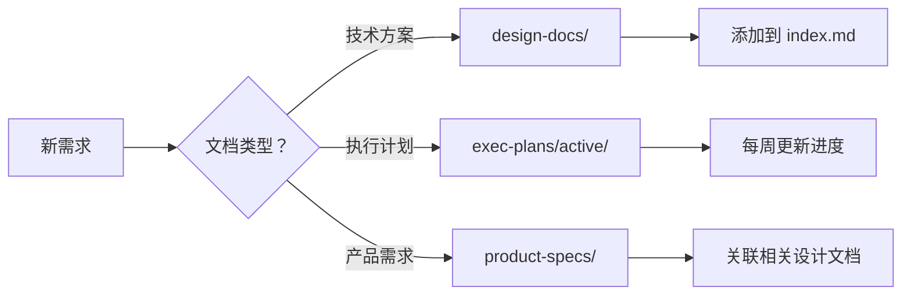

# OPC-HARNESS 文档中心

> **最后更新**: 2026-03-23  
> **文档状态**: ✅ 符合 OpenAI Harness Engineering 最佳实践

## 📚 文档导航

本目录按照 OpenAI Harness Engineering 最佳实践组织，支持 AI Agent 高效检索和理解项目信息。

### 核心索引

| 目录 | 用途 | 入口文件 |
|------|------|---------|
| [设计文档](./design-docs/) | 技术方案、架构决策 (ADRs) | [`index.md`](./design-docs/index.md) |
| [执行计划](./exec-plans/) | 活跃/已完成计划、技术债务 | [`index.md`](./exec-plans/index.md) |
| [产品规范](./product-specs/) | 产品需求文档、功能规格 | [`index.md`](./product-specs/index.md) |
| [参考资料](./references/) | 外部参考、最佳实践、工具库 | [`index.md`](./references/index.md) |
| [生成文档](./generated/) | 自动生成的文档 (如数据库 Schema) | - |

### 根目录关键文档

- [`AGENTS.md`](../AGENTS.md) - AI Agent 导航地图（精简版）
- [`ARCHITECTURE.md`](../ARCHITECTURE.md) - 系统架构设计
- [`src/AGENTS.md`](../src/AGENTS.md) - 前端开发规范
- [`src-tauri/AGENTS.md`](../src-tauri/AGENTS.md) - Rust 后端规范

### Harness 工具文档 ⭐️ NEW

所有 Harness Engineering 的完整文档已迁移到 [`references/`](./references/):

- **快速入门**: [`references/harness-quickstart.md`](./references/harness-quickstart.md) - 30 秒了解 Harness
- **完整指南**: [`references/harness-user-guide.md`](./references/harness-user-guide.md) - 详细使用手册
- **最佳实践**: [`references/best-practices.md`](./references/best-practices.md) - 团队协作最佳实践
- **架构规则**: [`references/architecture-rules.json`](./references/architecture-rules.json) - 前后端约束规则

### Harness 工具目录

- [`.harness/scripts/`](../.harness/scripts/) - 自动化脚本集合
  - `harness-check.ps1` - 架构健康检查
  - `harness-gc.ps1` - 垃圾回收
  - `harness-fix.ps1` - 代码质量修复
- [`.harness/cli-browser-verify/`](../.harness/cli-browser-verify/) - CLI 浏览器验证
- [`.harness/constraints/`](../.harness/constraints/) - 架构约束配置 (空目录保留)

---

## 🎯 文档组织原则

### 1. 渐进式披露 (Progressive Disclosure)

```
Level 1: AGENTS.md (根目录)     ← 导航地图，< 100 行
    ↓
Level 2: src/AGENTS.md          ← 模块规范，具体规则
    ↓
Level 3: design-docs/*.md       ← 详细设计，技术细节
```

**优势**:
- 避免一次性灌入大量上下文
- Agent 按需深入获取信息
- 减少 Token 消耗

### 2. 关注点分离 (Separation of Concerns)

- **设计文档** → `design-docs/` (技术方案)
- **执行计划** → `exec-plans/` (任务追踪)
- **产品规范** → `product-specs/` (需求说明)
- **参考资料** → `references/` (外部资源)
- **自动化工具** → `.harness/` (脚本和配置)

**优势**:
- 便于 AI 检索特定类型信息
- 分离活跃文档和历史文档
- 支持独立维护和更新

### 3. 可访问性优先 (Accessibility First)

- 每个目录必有 `index.md` 索引
- 关键文档提供快速定位链接
- 使用标准化命名便于搜索

**优势**:
- AI Agent 可以快速找到所需文档
- 减少迷路和重复查询
- 提高上下文检索效率

---

## 🔄 文档生命周期

### 创建流程



### 维护机制

#### 定期审查
- **每周**: 更新执行计划进度
- **每月**: 审查技术债务
- **每季度**: 清理过时文档 (harness:gc)

#### 新鲜度保证
- 所有文档包含"最后更新日期"
- >90 天未更新的文档自动标记⚠️
- harness:gc 脚本定期扫描过时内容

---

## 📊 文档统计

| 类别 | 文件数 | 最近更新时间 |
|------|--------|-------------|
| 设计文档 | 11+ | 2026-03-23 |
| 执行计划 | 8+ | 2026-03-23 |
| 产品规范 | 5+ | 2026-03-23 |
| 参考资料 | 12+ | 2026-03-23 |
| 生成文档 | 1+ | 2026-03-23 |
| **总计** | **37+** | - |

---

## 🛠️ 使用指南

### 对于 AI Agent

1. **从根目录开始**: 先阅读 [`AGENTS.md`](../AGENTS.md)
2. **按需深入**: 根据任务类型选择对应目录
3. **查看索引**: 每个目录的 `index.md` 提供完整导航
4. **更新进度**: 完成任务后更新 `exec-plans/active/`

### 对于人类开发者

1. **快速入门**: 查看 [`README.md`](../README.md)
2. **理解架构**: 阅读 [`ARCHITECTURE.md`](../ARCHITECTURE.md)
3. **开发规范**: 遵循 `src/AGENTS.md` 或 `src-tauri/AGENTS.md`
4. **追踪进度**: 查看 `exec-plans/active/`
5. **运行工具**: 使用 `.harness/scripts/` 中的脚本

---

## 📝 文档模板

### 设计文档模板

```
# {标题}

> **状态**: 草案 / 审查中 / 已采纳  
> **日期**: YYYY-MM-DD

## 背景
[问题描述和动机]

## 方案
[技术方案详细说明]

## 权衡
[优缺点分析、备选方案]

## 影响范围
[受影响的模块和文件]

## 实施计划
- [ ] 任务 1
- [ ] 任务 2

## 参考资源
[相关链接和文档]
```

### 执行计划模板

```
# 执行计划：{计划名称}

> **优先级**: P0-P3  
> **状态**: 🔄 进行中 / ✅ 完成 / ❌ 取消

## 目标
- 目标 1
- 目标 2

## 任务列表
- [ ] 任务 1
- [ ] 任务 2

## 决策日志
### YYYY-MM-DD
- **决策**: ...
- **原因**: ...

## 进展追踪
[统计数据、里程碑]
```

---

## 🚀 持续改进

基于 OpenAI Harness Engineering 最佳实践，我们持续优化文档结构:

- ✅ **Phase 1**: 文档结构重组 (2026-03-22 完成)
- ✅ **Phase 2**: docs/与.harness/整合 (2026-03-23 完成)
- ✅ **Phase 3**: .harness/清理完成 (2026-03-23 完成)
- 🔄 **Phase 4**: 架构护栏增强 (进行中)
- 📋 **Phase 5**: 进度追踪系统 (规划中)
- 📋 **Phase 6**: 反馈回路优化 (规划中)

查看完整规划：[`exec-plans/active/harness-optimization-2026-03.md`](./exec-plans/active/harness-optimization-2026-03.md)

---

## 🔗 相关资源

### Harness 工具脚本

所有自动化脚本位于 [`.harness/scripts/`](../.harness/scripts/):

```bash
# 架构健康检查
npm run harness:check

# 垃圾回收 (清理过时文档)
npm run harness:gc

# 代码质量修复
npm run harness:fix

# CLI 浏览器验证
npm run harness:verify:cli
```

### 架构约束规则

架构规则配置位于 [`references/architecture-rules.json`](./references/architecture-rules.json),定义前后端架构约束规则。

### CLI Browser 验证

CLI 浏览器验证工具位于 [`.harness/cli-browser-verify/`](../.harness/cli-browser-verify/),包含验证任务和脚本。

### 历史文档

以下历史文档归档在 [`exec-plans/completed/`](./exec-plans/completed/):
- [Harness Index (Legacy)](./exec-plans/completed/harness-index-legacy.md) - 旧版 Harness 索引
- [Infra-008 Verification Report](./exec-plans/completed/infra-008-verification-report.md) - SQLite 集成验证报告
- [Task Infra-008](./exec-plans/completed/task-infra-008-sqlite-integration.md) - SQLite 集成任务文档

---

**维护者**: OPC-HARNESS Team  
**贡献指南**: 提交 PR 前请运行 `npm run harness:check` 验证
