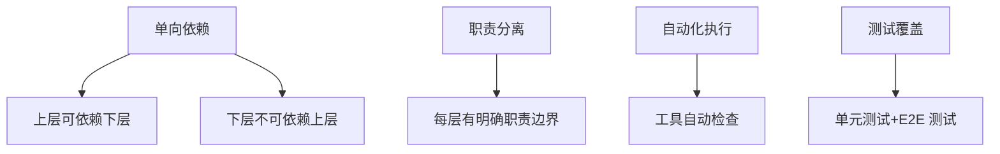

# 架构约束规则

> **版本**: v2.0  
> **最后更新**: 2026-03-23  
> **适用范围**: OPC-HARNESS 项目所有代码  
> **执行方式**: ESLint + Clippy 自动检查  
> **状态**: 🟢 已优化

---

## 📑 目录

- [概述](#-概述)
- [前端架构约束](#-前端架构约束-src)
- [后端架构约束](#-后端架构约束 src-tauri)
- [测试架构约束](#-测试架构约束-testing)
- [规则执行](#-规则执行)
- [常见问题](#-常见问题)

---

## 📋 概述

本文档定义了项目的架构约束规则，确保代码遵循分层架构和依赖方向。所有规则通过 ESLint 和 Cargo Clippy 自动执行。

### 核心原则



1. **单向依赖**: 上层可以依赖下层，下层不可依赖上层
2. **职责分离**: 每一层有明确的职责边界
3. **自动化执行**: 所有规则可通过工具自动检查
4. **测试覆盖**: 所有功能必须有单元测试 + E2E 测试覆盖

### 规则级别说明

| 级别 | 图标 | 处理方式 | 示例 |
|------|------|---------|------|
| **错误** | ❌ | 必须修复，CI/CD 会拦截 | 循环依赖、直接调用 API |
| **警告** | ⚠️ | 建议修复，影响代码质量 | 路径过深、命名不规范 |
| **建议** | 💡 | 可选遵循，最佳实践 | 代码组织、注释规范 |

---

## 🖥️ 前端架构约束 (src/)

### FE-ARCH-001: 状态管理层不可直接导入 UI 组件

**级别**: ❌ 错误 (error)  
**规则**: `stores/` 目录下的文件不能导入 `components/` 目录

**示例**:

```typescript
// ❌ 错误 - stores/projectStore.ts
import { ProjectCard } from '@/components/ProjectCard';

// ✅ 正确 - stores/projectStore.ts
// Store 保持纯净，不导入任何组件
export const useProjectStore = create((set) => ({
  projects: [],
  addProject: (project) => set((state) => ({ 
    projects: [...state.projects, project] 
  })),
}));
```

**原因**:
- Store 层仅管理状态，不应关心 UI 实现
- 保持单向依赖：Components → Stores
- 便于单元测试（Store 不依赖具体组件）

**修复建议**: Store 层应该保持纯净，仅管理状态。如需使用组件，请通过 Hooks 层中转。

**违反后果**: 
- ESLint 报错：`no-restricted-imports`
- 架构检查失败：`npm run harness:check`

---

### FE-ARCH-002: Hooks 不可直接导入具体业务组件

**级别**: ❌ 错误 (error)  
**规则**: `hooks/` 目录下的文件不能导入 `components/vibe-*/` 目录

**示例**:

```typescript
// ❌ 错误 - hooks/useAIStream.ts
import { VibeDesignForm } from '@/components/vibe-design/VibeDesignForm';

// ✅ 正确 - hooks/useAIStream.ts
// Hooks 应该是通用的，不依赖具体业务组件
export function useAIStream(config: AIConfig) {
  const [stream, setStream] = useState<ReadableStream | null>(null);
  
  const startStream = useCallback(async () => {
    // 通用流处理逻辑
  }, [config]);
  
  return { stream, startStream };
}
```

**原因**:
- Hooks 应该是可复用的通用逻辑
- 避免循环依赖：Hooks ↔ Components
- 便于跨模块复用

**修复建议**: Hooks 应该是通用的，不应依赖具体业务组件。考虑将组件逻辑上移到父组件。

---

### FE-ARCH-003: 工具函数层不可依赖状态管理层

**级别**: ❌ 错误 (error)  
**规则**: `lib/` 目录下的文件不能导入 `stores/` 目录

**示例**:

```typescript
// ❌ 错误 - lib/utils.ts
import { useAppStore } from '@/stores/appStore';

export function formatDate(date: Date): string {
  const locale = useAppStore.getState().locale; // 依赖全局状态
  return date.toLocaleDateString(locale);
}

// ✅ 正确 - lib/utils.ts
// 工具函数通过参数传递所需数据，不依赖全局状态
export function formatDate(date: Date, locale = 'zh-CN'): string {
  return date.toLocaleDateString(locale);
}

// 使用时传入所需参数
const formatted = formatDate(new Date(), appStore.locale);
```

**原因**:
- 工具函数应该是纯函数，便于测试
- 避免隐式依赖，提高可预测性
- 便于跨项目复用

**修复建议**: 工具函数应该是纯函数，不依赖全局状态。考虑通过参数传递所需数据。

---

### FE-ARCH-004: 优先使用路径别名

**级别**: ⚠️ 警告 (warn)  
**规则**: 相对路径深度不能超过 3 层

**示例**:

```typescript
// ❌ 避免：相对路径过深
import { Button } from '../../../components/ui/button';
import { utils } from '../../../../lib/utils';

// ✅ 推荐：使用路径别名
import { Button } from '@/components/ui/button';
import { utils } from '@/lib/utils';
```

**原因**:
- 提高代码可读性
- 重构时减少路径修改
- 统一的导入风格

**修复建议**: 使用路径别名可以提高可读性：`import { X } from '@/path/to/module'`

**配置方式** (vite.config.ts):

```typescript
export default defineConfig({
  resolve: {
    alias: {
      '@': fileURLToPath(new URL('./src', import.meta.url)),
    },
  },
});
```

---

### FE-ARCH-005: 禁止直接调用 Tauri invoke()

**级别**: ❌ 错误 (error)  
**规则**: `components/` 目录下的 `.tsx` 文件不能直接调用 `invoke()` 函数

**示例**:

```typescript
// ❌ 错误 - components/MyComponent.tsx
function MyComponent() {
  const handleSave = async () => {
    await invoke('save_project', { data }); // 直接调用
  };
}

// ✅ 正确 - stores/projectStore.ts
export const useProjectStore = create((set) => ({
  saveProject: async (data: ProjectData) => {
    try {
      const result = await invoke('save_project', { data });
      set({ lastSaved: new Date(), currentProject: result });
    } catch (error) {
      set({ error: error instanceof Error ? error.message : '保存失败' });
    }
  },
}));

// components/MyComponent.tsx
function MyComponent() {
  const { saveProject, error } = useProjectStore();
  const handleSave = () => saveProject(data);
  
  if (error) return <div>{error}</div>;
  return <button onClick={handleSave}>保存</button>;
}
```

**原因**:
- 统一错误处理
- 便于状态追踪
- 便于测试（可以 mock store）
- 符合单一职责原则

**修复建议**: 请通过 stores 或 hooks 封装 Tauri 调用：`useProjectStore().saveProject()`

---

## 🦀 后端架构约束 (src-tauri/)

### BE-ARCH-001: Commands 层不可包含复杂业务逻辑

**级别**: ❌ 错误 (error)  
**规则**:
- `commands/` 目录下的函数不能超过 30 行
- 不能直接调用 `db::` 或 `ai::` 命名空间

**示例**:

```rust
// ❌ 错误 - commands/projects.rs
#[tauri::command]
pub fn create_project(name: String) -> Result<Project, String> {
    // 直接在命令中操作数据库 - 超过 30 行
    let conn = get_connection()?;
    let project = Project { name, .. };
    conn.execute(...)?;  // 复杂的 SQL 逻辑
    log::info!("Created project"); // 日志记录
    notify_frontend(&project)?; // 通知前端
    // ... 更多业务逻辑
    Ok(project)
}

// ✅ 正确 - commands/projects.rs
#[tauri::command]
pub fn create_project(name: String) -> Result<Project, String> {
    // 仅做参数验证和错误处理 (< 30 行)
    if name.trim().is_empty() {
        return Err("项目名称不能为空".to_string());
    }
    
    // 委托给 Services 层
    services::create_project(name).await
}
```

**原因**:
- Commands 层仅负责参数验证和错误处理
- 业务逻辑集中在 Services 层，便于维护
- 便于单元测试（可以单独测试 Services）

**修复建议**: Commands 层仅做参数验证和错误处理，业务逻辑委托给 Services 层。

---

### BE-ARCH-002: Services 层不可依赖 Commands 层

**级别**: ❌ 错误 (error)  
**规则**: `services/` 目录不能导入 `crate::commands`

**示例**:

```rust
// ❌ 错误 - services/project_service.rs
use crate::commands::get_project_by_id; // 反向依赖

pub fn process_project(id: i32) -> Result<(), AppError> {
    let project = get_project_by_id(id)?; // 依赖 Commands 层
    // ...
}

// ✅ 正确 - services/project_service.rs
use crate::db::get_project_by_id; // 依赖 DB 层

pub fn process_project(id: i32) -> Result<(), AppError> {
    let project = get_project_by_id(id)?;
    // ...
}
```

**原因**:
- 依赖方向应该是：Commands → Services → DB
- 反向依赖会导致循环依赖
- 破坏分层架构

**修复建议**: 依赖方向应该是 Commands → Services，反向依赖会导致循环依赖。

---

### BE-ARCH-003: Database 层不可依赖 Services 层

**级别**: ❌ 错误 (error)  
**规则**: `db/` 目录不能导入 `crate::services`

**示例**:

```rust
// ❌ 错误 - db/project_db.rs
use crate::services::validate_project; // 依赖业务逻辑

pub fn save_project(project: &Project) -> Result<(), rusqlite::Error> {
    validate_project(project)?; // 不应该在 DB 层调用
    // ...
}

// ✅ 正确 - db/project_db.rs
// DB 层仅提供 CRUD 操作，不依赖业务逻辑
pub fn save_project(project: &Project) -> Result<(), rusqlite::Error> {
    let conn = get_connection()?;
    conn.execute(
        "INSERT INTO projects (name, description) VALUES (?1, ?2)",
        params![project.name, project.description],
    )?;
    Ok(())
}
```

**原因**:
- DB 层仅提供 CRUD 操作
- 业务逻辑在 Services 层实现
- 避免循环依赖

**修复建议**: DB 层仅提供 CRUD 操作，业务逻辑在 Services 层实现。

---

### BE-ARCH-004: 序列化必须使用 camelCase

**级别**: ❌ 错误 (error)  
**规则**: `models/` 目录下所有结构体必须包含 `#[serde(rename_all = "camelCase")]` 属性

**示例**:

```rust
// ❌ 错误
#[derive(Serialize, Deserialize)]
pub struct Project {
    pub created_at: String,  // 前端期望 createdAt
    pub updated_at: String,  // 前端期望 updatedAt
}

// ✅ 正确
#[derive(Serialize, Deserialize)]
#[serde(rename_all = "camelCase")]
pub struct Project {
    pub created_at: String,  // 序列化为 createdAt
    pub updated_at: String,  // 序列化为 updatedAt
}
```

**原因**:
- Rust 命名规范：snake_case
- TypeScript/JavaScript 命名规范：camelCase
- 前后端命名统一

**修复建议**: 添加 `#[serde(rename_all = "camelCase")]` 属性到结构体定义。

---

### BE-ARCH-005: 公共函数必须返回 Result 类型

**级别**: ❌ 错误 (error)  
**规则**: `services/` 目录下所有公共函数必须返回 `Result<_, AppError>` 类型

**示例**:

```rust
// ❌ 错误
pub fn save_project(project: Project) -> Project {
    // 没有错误处理
    db::save(project)
}

// ✅ 正确
pub async fn save_project(project: Project) -> Result<Project, AppError> {
    validate_project(&project)?;
    let saved = db::save_project(project).await?;
    Ok(saved)
}
```

**原因**:
- 统一的错误处理机制
- 明确的错误类型
- 便于调用方处理错误

**修复建议**: 使用 `Result<T, AppError>` 作为返回类型，提供清晰的错误信息。

---

## 🧪 测试架构约束 (Testing)

### TEST-001: 所有功能必须有单元测试覆盖

**级别**: ❌ 错误 (error)  
**规则**:
- 每个新功能的代码文件必须包含对应的 `.test.ts` 或 `.test.tsx` 文件
- Rust 模块必须包含 `#[cfg(test)] mod tests` 测试模块
- 单元测试覆盖率目标 ≥70%

**示例**:

```typescript
// ✅ 正确 - 包含测试文件
// src/hooks/useOpenAIProvider.ts
export function useOpenAIProvider() { /* ... */ }

// src/hooks/useOpenAIProvider.test.ts - 必须存在
describe('useOpenAIProvider', () => {
  it('should initialize with default config', () => {
    const { result } = renderHook(() => useOpenAIProvider());
    expect(result.current.config).toBeDefined();
  });
});

// ❌ 错误 - 缺少测试
// src/hooks/useNewFeature.ts
export function useNewFeature() { /* ... */ }
// 没有 test.ts 文件！
```

**Rust 示例**:

```rust
// src/ai/mod.rs

// ... 实现代码 ...

#[cfg(test)]
mod tests {
    use super::*;

    #[test]
    fn test_provider_creation() {
        let provider = OpenAIProvider::new("test-key".to_string());
        assert_eq!(provider.api_key(), "test-key");
    }
}
```

**修复建议**: 为每个新功能创建对应的测试文件，确保测试覆盖率≥70%。

**执行方式**:
- TypeScript: Vitest (`npm run test:unit`)
- Rust: Cargo Test (`cd src-tauri && cargo test`)

---

### TEST-002: 核心流程必须有 E2E 测试覆盖

**级别**: ❌ 错误 (error)  
**规则**:
- 所有核心用户流程必须包含 E2E 测试用例
- E2E 测试必须覆盖：应用启动、核心页面导航、关键配置流程
- E2E 测试必须自动管理开发服务器生命周期

**示例**:

```typescript
// ✅ 正确 - E2E 测试覆盖核心流程
// e2e/app.spec.ts
describe('OPC-HARNESS Application', () => {
  it('should load the application successfully', async () => {
    await page.goto('/');
    await expect(page).toHaveTitle(/OPC-HARNESS/);
  });
  
  it('should have valid HTML structure', async () => {
    const html = await page.innerHTML('body');
    expect(html).not.toContain('<script>'); // 无语法错误
  });
  
  it('should navigate to Settings page', async () => {
    await page.click('[data-testid="settings-button"]');
    await expect(page).toHaveURL('/settings');
  });
  
  it('should detect installed tools', async () => {
    await page.goto('/');
    const tools = await page.$$('.tool-detector-item');
    expect(tools.length).toBeGreaterThan(0);
  });
});

// ❌ 错误 - 缺少 E2E 测试
// 只有单元测试，没有端到端测试
```

**E2E 测试要求**:
1. **自动服务器管理**: 检测端口占用、自动启停开发服务器
2. **测试报告生成**: 自动生成 HTML 测试报告并保存
3. **优雅清理机制**: 测试结束后清理所有资源
4. **跨平台兼容**: 支持 Windows/Linux/macOS

**修复建议**: 在 `e2e/` 目录下创建 `.spec.ts` 文件，覆盖核心用户流程。

**执行方式**:
```bash
npm run test:e2e              # 运行所有 E2E 测试
npx vitest run e2e           # 直接运行 Vitest E2E
```

---

### TEST-003: 测试必须先于功能完成

**级别**: ❌ 错误 (error)  
**规则**:
- 遵循测试先行 (TDD) 原则
- 功能代码提交前，相关测试必须已编写并通过
- 不允许有无测试的功能代码

**示例**:

```typescript
// ✅ 正确的工作流 (TDD)

// 1. 先写测试
describe('useNewFeature', () => {
  it('should initialize with default state', () => {
    const { result } = renderHook(() => useNewFeature());
    expect(result.current.state).toEqual({ loading: false });
  });
});

// 2. 运行测试（失败）
npm run test:unit  // ❌ FAIL - 功能未实现

// 3. 实现功能
export function useNewFeature() {
  const [state, setState] = useState({ loading: false });
  return { state };
}

// 4. 再次运行测试（通过）
npm run test:unit  // ✅ PASS

// ❌ 错误的做法
// 先写功能代码，后补测试或不写测试
```

**原因**:
- TDD 确保代码可测试
- 测试驱动设计，代码质量更高
- 避免遗漏测试

**修复建议**: 采用 TDD 工作流：Red (测试失败) → Green (测试通过) → Refactor (重构)

---

### TEST-004: E2E 测试必须独立运行

**级别**: ⚠️ 警告 (warn)  
**规则**:
- E2E 测试不应依赖外部服务（如真实 API）
- 必须使用 Mock 数据或测试专用环境
- 测试用例之间不能有状态依赖

**示例**:

```typescript
// ✅ 正确 - 使用 Mock，独立运行
it('should handle chat request', async () => {
  // 使用 Mock 数据，不依赖真实 API
  const mockResponse = { content: 'Mock response' };
  vi.spyOn(api, 'chat').mockResolvedValue(mockResponse);

  const result = await chat({ messages: [] });
  expect(result).toEqual(mockResponse);
});

// ❌ 错误 - 依赖真实 API
it('should call real OpenAI API', async () => {
  // 不应该调用真实的 API
  const result = await realOpenAICall();
  expect(result).toBeDefined();
});

// ❌ 错误 - 测试之间有状态依赖
it('test 1', () => {
  // 修改了全局状态
  window.globalState = { count: 1 };
});

it('test 2', () => {
  // 依赖 test 1 的状态
  expect(window.globalState.count).toBe(1);
});
```

**原因**:
- 测试可重复，不受外部环境影响
- 测试速度快（不需要网络请求）
- 测试稳定性高

**修复建议**: 使用 Mock 数据和 Stub 技术，确保测试可重复且快速。

---

## 🔧 规则执行

### 自动化工具链

```bash
# TypeScript/React 检查
npm run lint              # ESLint 代码规范
npm run format            # Prettier 格式化
npm run type-check        # TypeScript 类型检查
npm run harness:check     # 架构约束检查

# Rust 检查
cd src-tauri
cargo check              # 编译检查
cargo clippy             # Lint 检查
cargo fmt --check        # 格式化检查

# 测试
npm run test:unit        # TypeScript 单元测试
cargo test               # Rust 单元测试
npm run test:e2e         # E2E 测试
```

### CI/CD 集成

在 GitHub Actions 中自动执行：

```yaml
# .github/workflows/ci.yml
jobs:
  quality-check:
    runs-on: ubuntu-latest
    steps:
      - uses: actions/checkout@v3
      
      - name: Install dependencies
        run: npm ci
        
      - name: Run linters
        run: npm run lint
        
      - name: Check architecture rules
        run: npm run harness:check
        
      - name: Run tests
        run: npm run test:unit
```

### 本地开发工作流

```bash
# 提交前检查清单
npm run type-check      # 1. 类型检查
npm run lint            # 2. 代码规范
npm run format          # 3. 格式化
npm run harness:check   # 4. 架构检查
npm run test:unit       # 5. 单元测试

# 全部通过后提交
git commit -m "feat: 实现 XXX 功能"
```

---

## ❓ 常见问题

### Q1: 为什么不能直接在组件中调用 `invoke()`？

**A**: 
- 难以统一错误处理
- 不利于状态追踪
- 测试困难（需要 mock invoke）
- 违反单一职责原则

**解决方案**: 通过 stores 或 hooks 封装 Tauri 调用。

### Q2: Commands 层的 30 行限制是否过于严格？

**A**: 
- 30 行是经验值，确保函数简洁
- 复杂逻辑应该提取到 Services 层
- 便于代码审查和维护

**解决方案**: 如果超过 30 行，考虑重构：
1. 提取公共逻辑到辅助函数
2. 将业务逻辑移至 Services 层
3. 使用管道模式组合小函数

### Q3: 如何平衡测试覆盖率和开发效率？

**A**: 
- 核心功能必须 100% 覆盖
- 简单函数可以适当降低要求
- 目标是≥70%，不是 100%
- 测试先行反而提高效率（减少调试时间）

**建议优先级**:
1. 核心业务逻辑（必须测试）
2. 工具函数（建议测试）
3. 纯 UI 组件（可选测试）

---

## 📚 参考资源

- [ESLint 配置指南](https://eslint.org/docs/user-guide/getting-started)
- [Rust Clippy 使用手册](https://doc.rust-lang.org/clippy/)
- [Testing Library 最佳实践](https://testing-library.com/docs/react-testing-library/intro/)
- [TDD 入门教程](https://www.agilealliance.org/glossary/tdd/)

---

**维护者**: OPC-HARNESS Architecture Team  
**贡献者**: 欢迎提交 PR 改进架构规则  
**许可证**: 同项目主许可证
