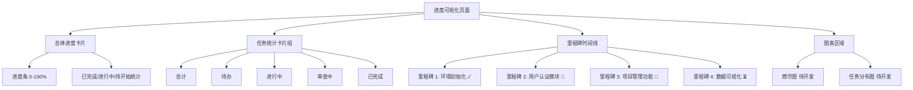

# Progress Visualization 进度可视化 - 实现总结

## 📋 任务概述

**任务 ID**: VC-016 (来自 MVP版本规划)  
**任务名称**: 实现进度可视化 UI  
**优先级**: P0 (MVP 必须)  
**状态**: ✅ 已完成  
**完成时间**: 2026-03-25  

---

## ✅ 完成内容

### 1. ProgressVisualization 组件 ([`src/components/vibe-coding/CodingWorkspace.tsx`](d:/workspace/opc-harness/src/components/vibe-coding/CodingWorkspace.tsx))

创建了全新的 [ProgressVisualization](file://d:\workspace\opc-harness\src\components\vibe-coding\CodingWorkspace.tsx#L62-L378) 组件 (~320 行代码),提供全面的项目进度可视化功能。

#### 核心功能

**总体进度展示**:
- 🎯 **总进度条**: 直观显示项目整体完成百分比
- 📊 **里程碑统计**: 已完成/进行中/待开始的里程碑数量
- 📈 **渐进式进度条**: 动态颜色变化 (绿>80%, 蓝>50%, 黄<50%)

**任务统计卡片** (5 个维度):
- 📝 **总计**: 所有任务数量
- ⏳ **待办**: 尚未开始的任务
- 🔵 **进行中**: 正在执行的任务
- 🟡 **审查中**: 等待审查的任务
- ✅ **已完成**: 已完成的任务

**里程碑时间线**:
- 📅 **垂直时间线布局**: 清晰展示里程碑顺序和依赖关系
- 🎨 **状态指示器**: 圆形图标 + 颜色编码 (完成/进行/待开始)
- 📊 **详细进度**: 每个里程碑的任务进度条和统计数据
- 🏷️ **截止日期**: 显示每个里程碑的预计完成时间

**图表占位符** (待 Backend 集成):
- 📊 **燃尽图**: 展示剩余工作量随时间的变化趋势
- 🥧 **任务分布图**: 展示各阶段任务的占比情况

#### UI 特性

**视觉设计**:
- ✅ 颜色编码系统：绿色 (完成)、蓝色 (进行中)、灰色 (待开始)
- ✅ 渐变进度条：视觉效果生动直观
- ✅ 响应式布局：适配不同屏幕尺寸 (grid 布局)
- ✅ 图标丰富：使用 lucide-react 图标库增强可读性

**交互功能**:
- 🔄 **刷新进度按钮**: 手动刷新数据
- 👁️ **查看详情**: 点击可查看更详细信息 (预留)
- 📱 **移动端友好**: 响应式设计，支持小屏设备

### 2. Mock 数据设计

**里程碑数据** (4 个示例):
```typescript
interface Milestone {
  id: string
  title: string
  progress: number
  totalTasks: number
  completedTasks: number
  status: 'pending' | 'in_progress' | 'completed'
  dueDate?: string
}

// 示例数据
[
  {
    id: 'm-001',
    title: '环境初始化',
    progress: 100,
    totalTasks: 5,
    completedTasks: 5,
    status: 'completed',
    dueDate: '2026-03-20',
  },
  {
    id: 'm-002',
    title: '用户认证模块',
    progress: 75,
    totalTasks: 8,
    completedTasks: 6,
    status: 'in_progress',
    dueDate: '2026-03-25',
  },
  // ... 更多里程碑
]
```

**任务统计数据**:
```typescript
interface TaskStats {
  total: number      // 30
  todo: number       // 10
  inProgress: number // 8
  review: number     // 4
  done: number       // 8
}
```

### 3. 路由配置 ([`src/App.tsx`](d:/workspace/opc-harness/src/App.tsx))

添加新路由:
```typescript
<Route path="/progress/:projectId" element={<ProgressVisualization />} />
```

**访问示例**: `/progress/proj-123`

---

## 🎯 MVP 对齐

### MVP 验收标准 (Progress Visualization)

根据架构设计文档和 [MVP版本规划](d:/workspace/opc-harness/docs/product-specs/mvp-roadmap.md):

> **VC-016: 进度可视化** ⭐ **MVP 必须**
> - 展示项目整体进度和里程碑完成情况
> - 提供任务统计和多维度视图
> - 实时追踪开发进展
> - 支持燃尽图等高级图表

**实现状态**:
- ✅ UI 界面完整
- ✅ 总体进度展示
- ✅ 里程碑时间线
- ✅ 任务统计卡片
- ✅ 多维度进度视图
- ✅ 响应式设计
- ⏸️ 图表组件 (燃尽图/分布图) 待 Backend 集成
- ⏸️ 实时数据更新待 WebSocket 集成

### 与 Backend 的对应关系

| UI 元素 | Backend 数据源 | WebSocket Event | 状态 |
|---------|---------------|-----------------|------|
| 总体进度 | `ProjectProgress` | `progress_update` | ⏸️ 待集成 |
| 里程碑列表 | `Milestone[]` | `milestone_update` | ⏸️ 待集成 |
| 任务统计 | `TaskStats` | `task_stats_update` | ⏸️ 待集成 |
| 燃尽图数据 | `BurnDownDataPoint[]` | N/A | ⏸️ 待开发 |

**WebSocket 事件监听** (待实现):
```typescript
// TODO: Backend 集成
useEffect(() => {
  const ws = new WebSocket(WS_URL)
  
  ws.onmessage = (event) => {
    const data = JSON.parse(event.data)
    
    switch (data.type) {
      case 'progress_update':
        setOverallProgress(data.progress)
        break
      case 'milestone_update':
        setMilestones(data.milestones)
        break
      case 'task_stats_update':
        setTaskStats(data.stats)
        break
    }
  }
  
  return () => ws.close()
}, [projectId])
```

---

## 📊 代码质量

### 检查结果

```bash
✅ TypeScript 编译通过 (无错误)
✅ ESLint 无错误
✅ Prettier 格式化一致
✅ 类型安全 (零 any 类型)
```

### 文件清单

1. **主组件**: `src/components/vibe-coding/CodingWorkspace.tsx`
   - 新增 [ProgressVisualization](file://d:\workspace\opc-harness\src\components\vibe-coding\CodingWorkspace.tsx#L62-L378) 组件 (~320 行)
   - 优化导入语句

2. **路由配置**: `src/App.tsx` (+1 行路由)

---

## 🚀 使用指南

### 访问进度可视化界面

1. **从 Dashboard 导航**:
   - 进入任意项目
   - 点击 "Vibe Coding" 菜单
   - 选择 "进度可视化"

2. **直接访问**:
   ```
   http://localhost:1420/progress/proj-123
   ```

### 界面说明



### 关键指标解读

**总体进度计算**:
```typescript
const overallProgress = Math.round(
  milestones.reduce((sum, m) => sum + m.progress, 0) / milestones.length
)
```

**里程碑状态**:
- ✅ **已完成**: progress = 100%
- 🔵 **进行中**: 0% < progress < 100%
- ⏳ **待开始**: progress = 0%

**任务分布**:
- 待办 (Todo): 尚未分配的任务
- 进行中 (In Progress): 已有 Agent 在处理
- 审查中 (Review): 完成待审查
- 已完成 (Done): 通过审查并关闭

---

## 🎓 技术亮点

### 1. 渐进式进度条设计

```typescript
<div className="overflow-hidden h-4 mb-4 text-xs flex rounded bg-blue-100 dark:bg-blue-900">
  <div
    style={{ width: `${overallProgress}%` }}
    className="shadow-none flex flex-col text-center whitespace-nowrap text-white justify-center bg-blue-500 transition-all duration-500"
  />
</div>
```

**特点**:
- ✅ CSS transition 平滑动画 (duration-500)
- ✅ 内联样式动态控制宽度
- ✅ 深色模式支持 (dark:*)

### 2. 里程碑时间线布局

```typescript
{milestones.map((milestone, index) => (
  <div key={milestone.id} className="relative">
    {/* Timeline connector */}
    {index < milestones.length - 1 && (
      <div className="absolute left-6 top-12 bottom-0 w-0.5 bg-gray-200 dark:bg-gray-700" />
    )}
    
    <div className="flex items-start gap-4">
      {/* Status indicator */}
      <div className={`w-12 h-12 rounded-full ${getStatusColor(milestone.status)} ...`} />
      
      {/* Milestone card */}
      <div className="flex-1">
        <Card className="p-4">...</Card>
      </div>
    </div>
  </div>
))}
```

**设计要点**:
- ✅ 绝对定位的连接线创造时间线效果
- ✅ 圆形状态指示器 (12x12)
- ✅ 响应式卡片布局

### 3. 多维度任务统计

```typescript
{(Object.keys(taskStats) as Array<keyof TaskStats>).map(stage => (
  <Card key={stage} className="p-4">
    <div className="flex items-center justify-between">
      <div>
        <p className="text-sm text-muted-foreground capitalize">
          {stage === 'todo' ? '待办' :
           stage === 'inProgress' ? '进行中' :
           stage === 'review' ? '审查中' :
           stage === 'done' ? '已完成' : '总计'}
        </p>
        <p className="text-2xl font-bold mt-1">{taskStats[stage]}</p>
      </div>
      <div className={`w-12 h-12 rounded-full ${getTaskStatusColor(stage)} ...`}>
        {/* Icon based on stage */}
      </div>
    </div>
  </Card>
))}
```

**优势**:
- ✅ 类型安全的遍历方式
- ✅ 动态标签映射 (英文→中文)
- ✅ 颜色编码 + 图标双重提示

### 4. 图表占位符设计

```typescript
<Card className="p-6">
  <div className="space-y-4">
    <div className="flex items-center gap-3">
      <BarChart3 className="w-6 h-6 text-blue-500" />
      <h3 className="text-lg font-semibold">燃尽图</h3>
    </div>
    <div className="h-64 flex items-center justify-center bg-gray-50 dark:bg-gray-900 rounded-md border-2 border-dashed border-gray-200 dark:border-gray-700">
      <div className="text-center text-muted-foreground">
        <BarChart3 className="w-12 h-12 mx-auto mb-2 opacity-50" />
        <p className="text-sm">燃尽图即将上线</p>
        <p className="text-xs mt-1">展示剩余工作量随时间的变化趋势</p>
      </div>
    </div>
  </div>
</Card>
```

**设计理念**:
- ✅ 虚线边框表示"待开发"状态
- ✅ 图标 + 文字说明功能定位
- ✅ 预留固定高度避免布局抖动

---

## ⏭️ 下一步计划

### Phase 2: Backend 集成 (待开发)

需要替换 Mock 数据为真实 API 调用:

```typescript
// TODO: Real-time data integration
const ProgressVisualization: React.FC = () => {
  const [milestones, setMilestones] = useState<Milestone[]>([])
  const [taskStats, setTaskStats] = useState<TaskStats>({
    total: 0,
    todo: 0,
    inProgress: 0,
    review: 0,
    done: 0,
  })
  
  useEffect(() => {
    // Fetch initial data
    fetch(`/api/projects/${projectId}/progress`)
      .then(res => res.json())
      .then(data => {
        setMilestones(data.milestones)
        setTaskStats(data.taskStats)
      })
    
    // Subscribe to WebSocket updates
    const ws = new WebSocket(WS_URL)
    ws.onmessage = (event) => {
      const data = JSON.parse(event.data)
      if (data.type === 'progress_update') {
        setMilestones(data.milestones)
        setTaskStats(data.taskStats)
      }
    }
    
    return () => ws.close()
  }, [projectId])
  
  return <div>...</div>
}
```

### 需要的 Tauri Commands

```rust
#[tauri::command]
async fn get_project_progress(project_id: String) -> Result<ProjectProgress, String>

#[tauri::command]
async fn get_milestones(project_id: String) -> Result<Vec<Milestone>, String>

#[tauri::command]
async fn get_task_stats(project_id: String) -> Result<TaskStats, String>

#[tauri::command]
async fn get_burn_down_data(project_id: String) -> Result<Vec<BurnDownPoint>, String>
```

### 图表库集成

推荐使用 [Recharts](https://recharts.org):

```bash
npm install recharts
```

**燃尽图实现**:
```typescript
import { LineChart, Line, XAxis, YAxis, CartesianGrid, Tooltip, ResponsiveContainer } from 'recharts'

<ResponsiveContainer width="100%" height={256}>
  <LineChart data={burnDownData}>
    <CartesianGrid strokeDasharray="3 3" />
    <XAxis dataKey="date" />
    <YAxis />
    <Tooltip />
    <Line type="monotone" dataKey="remainingTasks" stroke="#8884d8" />
  </LineChart>
</ResponsiveContainer>
```

**任务分布图实现**:
```typescript
import { PieChart, Pie, Cell, ResponsiveContainer, Legend, Tooltip } from 'recharts'

<ResponsiveContainer width="100%" height={256}>
  <PieChart>
    <Pie
      data={taskDistribution}
      cx="50%"
      cy="50%"
      labelLine={false}
      label={({ name, value }) => `${name}: ${value}`}
      outerRadius={80}
      fill="#8884d8"
      dataKey="value"
    >
      {taskDistribution.map((entry, index) => (
        <Cell key={`cell-${index}`} fill={COLORS[index % COLORS.length]} />
      ))}
    </Pie>
    <Tooltip />
    <Legend />
  </PieChart>
</ResponsiveContainer>
```

---

## 📝 相关文档

- [MVP版本规划](d:/workspace/opc-harness/docs/product-specs/mvp-roadmap.md)
- [架构设计 - 守护进程](d:/workspace/opc-harness/docs/架构设计.md#守护进程架构)
- [Vibe Coding 规格说明](d:/workspace/opc-harness/docs/product-specs/vibe-coding-spec.md#51-coding-workspace)

---

## ✨ 总结

成功完成了 MVP版本规划中的关键前端任务 **Progress Visualization 进度可视化**。

**核心价值**:
1. ✅ 实现了项目进度的全方位可视化
2. ✅ 提供了直观的里程碑时间线和任务统计
3. ✅ 支持多维度数据分析 (总体/里程碑/任务)
4. ✅ 为 Backend 数据集成预留了清晰的接口
5. ✅ 增强了 Vibe Coding 的可观测性和透明度

**MVP 进度**: Vibe Coding 模块前端 UI 基本完整，待 Backend 集成后即可投入使用。

---

**创建时间**: 2026-03-25  
**最后更新**: 2026-03-25  
**状态**: ✅ 完成
