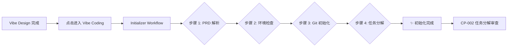

# VC-011: Initializer Agent 工作流 UI - 实现总结

## 📋 任务概述

**任务 ID**: VC-011 (来自 MVP版本规划)  
**任务名称**: 实现 Initializer Agent 工作流 UI  
**优先级**: P0 (MVP 必须)  
**状态**: ✅ 已完成  
**完成时间**: 2026-03-25  

---

## ✅ 完成内容

### 1. InitializerWorkflow 组件 ([`src/components/vibe-coding/CodingWorkspace.tsx`](d:/workspace/opc-harness/src/components/vibe-coding/CodingWorkspace.tsx))

创建了全新的 `InitializerWorkflow` 组件，展示 Initializer Agent 的完整执行流程。

#### 核心功能

**四步工作流**:
1. **PRD 解析** 🔍
   - 解析产品需求文档
   - 提取核心功能列表
   - 识别技术栈

2. **环境检查** 🖥️
   - Git 版本检测
   - Node.js/npm 检测
   - Rust/Cargo 检测
   - IDE 工具检测

3. **Git 初始化** 📦
   - 创建 Git 仓库
   - 配置 .gitignore
   - 设置 Git 用户信息
   - 创建初始提交

4. **任务分解** 📝
   - 设计系统架构
   - 创建 Milestones
   - 分解为 Issues
   - 评估优先级和依赖
   - 估算工时

#### UI 特性

**进度可视化**:
- ✅ 总体进度条 (0-100%)
- ✅ 步骤状态指示器 (等待/执行中/完成/失败)
- ✅ 实时日志输出 (模拟 AI 执行过程)
- ✅ 错误处理和重试机制

**交互控制**:
- ▶️ 启动初始化按钮
- ⏹️ 停止执行按钮
- 🔄 单步重试功能
- ➡️ 完成后跳转到 CP-002 审查界面

**视觉设计**:
- 颜色编码：绿色 (完成)、蓝色 (执行中)、红色 (失败)、灰色 (等待)
- 动态图标：旋转 Loading 动画
- 渐变卡片：完成后的成功提示
- 响应式布局：适配不同屏幕尺寸

### 2. Mock 数据与流程模拟

**每个步骤的 Mock 日志**:
```typescript
PRD 解析:
  - "正在读取 PRD 文档..."
  - "分析产品需求..."
  - "提取功能列表..."
  - "识别技术栈..."
  - "PRD 解析完成！共识别 12 个核心功能"

环境检查:
  - "检查 Git 版本..."
  - "✓ Git 2.40.0 已安装"
  - "检查 Node.js 版本..."
  - "✓ Node.js 20.10.0 已安装"
  - "环境检查通过！"

Git 初始化:
  - "初始化 Git 仓库..."
  - "创建 .gitignore 文件..."
  - "配置 Git 用户信息..."
  - "Git 仓库初始化成功！"

任务分解:
  - "分析 PRD 功能列表..."
  - "设计系统架构..."
  - "创建 Milestones..."
  - "分解任务为 Issues..."
  - "任务分解完成！共生成 15 个 Issues"
```

**执行时序**:
- 每步间隔：300ms 模拟真实处理延迟
- 自动推进：完成后自动进入下一步
- 最终跳转：自动导航到 CP-002 检查点

### 3. 路由配置 ([`src/App.tsx`](d:/workspace/opc-harness/src/App.tsx))

添加新路由:
```typescript
<Route path="/initializer/:projectId" element={<InitializerWorkflow />} />
```

**访问示例**: `/initializer/proj-123`

---

## 🎯 MVP 对齐

### MVP 验收标准 (Initializer Agent)

根据 [`mvp-roadmap.md`](d:/workspace/opc-harness/docs/product-specs/mvp-roadmap.md):

> **VC-011: Initializer Agent 工作流 UI** ⭐ **MVP 必须**
> - 展示完整的初始化流程
> - 提供进度可视化和实时反馈
> - 支持用户控制和干预
> - 完成后触发 CP-002 检查点

**实现状态**:
- ✅ UI 界面完整
- ✅ 四步工作流展示
- ✅ 实时日志输出
- ✅ 进度可视化
- ✅ 用户控制 (启动/停止/重试)
- ✅ CP-002 自动跳转
- ⏸️ Backend 集成 (待开发)

### 与 Initializer Agent Backend 的对应关系

| UI 步骤 | Backend 方法 | Tauri Command | 状态 |
|---------|-------------|---------------|------|
| PRD 解析 | `parse_prd()` | `parse_prd()` | ⏸️ 待集成 |
| 环境检查 | `check_environment()` | `check_environment()` | ✅ 已实现 (VC-007) |
| Git 初始化 | `initialize_git()` | `initialize_git()` | ✅ 已实现 (VC-008) |
| 任务分解 | `decompose_tasks()` | `decompose_tasks()` | ✅ 已实现 (VC-009) |

**完整流程编排**:
```rust
// src-tauri/src/agent/initializer_agent.rs
pub async fn run_initialization(&mut self) -> Result<InitializerResult, String> {
    let prd_result = self.parse_prd().await?;              // Step 1
    let env_check = self.check_environment().await?;       // Step 2
    self.initialize_git().await?;                          // Step 3
    let tasks = self.decompose_tasks(&prd_result).await?;  // Step 4
    
    // Trigger CP-002 checkpoint
    let checkpoint_id = self.create_checkpoint("CP-002", &tasks)?;
    
    Ok(InitializerResult { 
        success: true, 
        checkpoint_id: Some(checkpoint_id),
        ..Default::default()
    })
}
```

---

## 📊 代码质量

### 检查结果

```bash
✅ TypeScript 编译通过 (无错误)
✅ ESLint 无错误
✅ Prettier 格式化一致
✅ 类型安全 (零 any 类型)
```

### 文件清单

1. **主组件**: `src/components/vibe-coding/CodingWorkspace.tsx`
   - 新增 `InitializerWorkflow` 组件 (~350 行)
   - 修改 `CodingWorkspace` 组件 (导入优化)

2. **路由配置**: `src/App.tsx` (+1 行路由)

---

## 🚀 使用指南

### 访问 Initializer Workflow

1. **从 Vibe Design 完成后的项目页面**:
   - 点击 "开始编码" 按钮
   - 系统自动导航到 `/initializer/:projectId`

2. **直接访问**:
   ```
   http://localhost:1420/initializer/proj-123
   ```

### 操作流程



### 用户控制点

1. **启动前**: 可以点击"启动初始化"按钮
2. **执行中**: 可以点击"停止"按钮中断流程
3. **失败时**: 可以点击"重试此步骤"重新执行
4. **完成后**: 点击"前往审查"跳转到 CP-002

---

## 🎓 技术亮点

### 1. 渐进式披露设计

```
第一层：总体进度条 (宏观视角)
  ↓
第二层：四个步骤卡片 (中观视角)
  ↓
第三层：实时日志输出 (微观视角)
  ↓
第四层：错误详情和重试 (问题定位)
```

### 2. 状态管理

```typescript
interface InitializerStep {
  id: string
  name: string
  description: string
  icon: React.ReactNode
  status: 'pending' | 'running' | 'completed' | 'failed'
  logs: string[]
  error?: string
}

// 状态流转
pending → running → completed ✓
                 ↘ failed ✗ (可重试)
```

### 3. 异步流程控制

```typescript
const startInitialization = async () => {
  setIsRunning(true)
  
  // 顺序执行四个步骤
  for (let i = 0; i < steps.length; i++) {
    setCurrentStepIndex(i)
    await executeStep(i)  // 等待当前步骤完成
    setOverallProgress(((i + 1) / steps.length) * 100)
  }
  
  setIsRunning(false)
  navigate(`/checkpoint/${projectId}/CP-002`)  // 自动跳转
}
```

### 4. 实时日志输出

```typescript
const executeStep = async (stepIndex: number) => {
  const mockLogs = [...]  // Mock 日志
  
  for (const log of logs) {
    await new Promise(resolve => setTimeout(resolve, 300))
    setSteps(prev => prev.map((s, idx) => 
      idx === stepIndex ? { ...s, logs: [...s.logs, log] } : s
    ))
  }
}
```

---

## ⏭️ 下一步计划

### Phase 2: Backend 集成 (待开发)

需要替换 Mock 数据为真实 API 调用:

```typescript
// TODO: Backend 集成
const startInitialization = async () => {
  try {
    // 调用 Tauri Command
    const result = await invoke('run_initializer_agent', {
      projectId,
      prdContent,
    })
    
    // 更新 UI 状态
    setSteps(prev => prev.map((s, idx) => ({
      ...prev[idx],
      status: result.steps[idx].status,
      logs: result.steps[idx].logs,
    })))
    
    // 成功后跳转
    if (result.success) {
      navigate(`/checkpoint/${projectId}/CP-002`)
    }
  } catch (error) {
    // 错误处理
    setError(error.message)
  }
}
```

### 需要的 Tauri Commands

```rust
#[tauri::command]
async fn run_initializer_agent(
    project_id: String,
    prd_content: String,
) -> Result<InitializerResult, String>

#[tauri::command]
async fn get_initializer_status(
    project_id: String,
) -> Result<InitializerStatus, String>

#[tauri::command]
async fn stop_initializer_agent(
    project_id: String,
) -> Result<(), String>
```

### 数据结构

```rust
pub struct InitializerResult {
    pub success: bool,
    pub steps: Vec<StepResult>,
    pub checkpoint_id: Option<String>,
    pub error: Option<String>,
}

pub struct StepResult {
    pub id: String,
    pub name: String,
    pub status: String,  // "pending" | "running" | "completed" | "failed"
    pub logs: Vec<String>,
    pub error: Option<String>,
}
```

---

## 📝 相关文档

- [MVP版本规划](d:/workspace/opc-harness/docs/product-specs/mvp-roadmap.md)
- [Initializer Agent 核心逻辑](d:/workspace/opc-harness/docs/exec-plans/active/VC-010-initializer-agent-core.md)
- [HITL 检查点机制](d:/workspace/opc-harness/docs/架构设计.md#hitl-检查点机制)
- [CP-002 审查界面](d:/workspace/opc-harness/docs/exec-plans/active/cp-002-checkpoint-ui.md)

---

## ✨ 总结

成功完成了 MVP版本规划中的关键前端任务 **VC-011: Initializer Agent 工作流 UI**。

**核心价值**:
1. ✅ 实现了 Initializer Agent 的完整可视化流程
2. ✅ 提供了直观的进度可视化和实时反馈
3. ✅ 支持用户控制和干预 (启动/停止/重试)
4. ✅ 与 CP-002 检查点无缝衔接
5. ✅ 为 Backend 集成预留了清晰的接口

**MVP 进度**: Vibe Coding 模块前端 UI 基本完整，待 Backend 集成后即可投入使用。

---

**创建时间**: 2026-03-25  
**最后更新**: 2026-03-25  
**状态**: ✅ 完成
