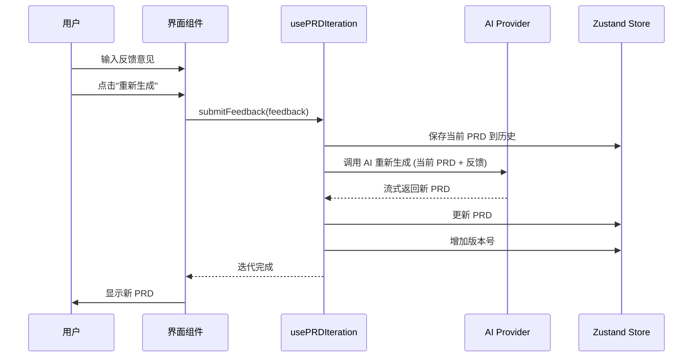

# US-053: 迭代优化 - 执行计划

**创建时间**: 2026-03-30  
**执行人**: AI Agent  
**任务优先级**: P1  
**预计工作量**: 4 小时

---

## 📋 任务概述

### 用户故事

作为用户，我希望提供反馈并重新生成 PRD，以便改进 PRD 质量。

### 验收标准

- ✅ 支持至少 3 轮迭代
- ✅ 用户可以输入反馈意见
- ✅ 系统根据反馈重新生成 PRD
- ✅ 保留历史版本记录
- ✅ 单元测试覆盖率 ≥ 70%

---

## 🎯 关键结果 (Key Results)

### KR-01: 核心功能实现

- [ ] 实现迭代优化 Hook (`usePRDIteration`)
- [ ] 支持用户反馈输入
- [ ] 实现 PRD 重新生成逻辑
- [ ] 版本历史记录（至少 3 个版本）

### KR-02: 质量保证

- [ ] TypeScript 编译通过（0 错误）
- [ ] ESLint 检查通过（0 错误）
- [ ] Prettier 格式化一致
- [ ] 单元测试通过率 100%

### KR-03: Harness Engineering 合规

- [ ] 遵循 FE-ARCH 架构约束
- [ ] 遵循 TEST 测试约束
- [ ] 执行计划完整归档
- [ ] Git 提交信息规范

---

## 💡 解决方案设计

### 架构设计

```
┌─────────────────────────────────────┐
│         用户界面层                   │
│  - 反馈输入框                        │
│  - 迭代历史列表                      │
│  - 版本对比视图                      │
└─────────────────────────────────────┘
              ↓
┌─────────────────────────────────────┐
│       React Hooks 层                 │
│  - usePRDIteration (新增)           │
│  - usePRDStream (已有)              │
└─────────────────────────────────────┘
              ↓
┌─────────────────────────────────────┐
│       类型定义层                     │
│  - PRDIterationHistory              │
│  - PRDVersion                       │
│  - UserFeedback                     │
└─────────────────────────────────────┘
              ↓
┌─────────────────────────────────────┐
│       AI Provider 层                 │
│  - OpenAI API 调用                  │
│  - 流式响应处理                      │
└─────────────────────────────────────┘
```

### 核心流程



### 数据结构设计

```typescript
// 用户反馈
interface UserFeedback {
  version: number
  feedback: string
  timestamp: Date
}

// PRD 版本
interface PRDVersion {
  version: number
  prd: PRD
  feedback?: UserFeedback
  createdAt: Date
  changes?: string[] // 变更说明
}

// 迭代历史
interface PRDIterationHistory {
  currentVersion: number
  versions: PRDVersion[]
  maxVersions: number // 默认保留最近 10 个版本
}
```

---

## 🏗️ 技术实现方案

### 1. 类型定义扩展

文件：`src/types/prd.ts`

新增接口：

- `UserFeedback`
- `PRDVersion`
- `PRDIterationHistory`

### 2. 自定义 Hook 实现

文件：`src/hooks/usePRDIteration.ts` (新建)

核心方法：

- `submitFeedback(feedback: string): Promise<void>`
- `getVersionHistory(): PRDVersion[]`
- `restoreToVersion(version: number): void`
- `getCurrentVersion(): number`
- `clearHistory(): void`

状态管理：

- `isIterating: boolean` - 迭代中状态
- `error: Error | null` - 错误处理
- `history: PRDIterationHistory` - 版本历史

### 3. 集成到现有 Hook

文件：`src/hooks/usePRDStream.ts`

扩展功能：

- 添加 `iteration` 属性
- 支持从历史版本恢复

### 4. 单元测试

文件：`src/hooks/usePRDIteration.test.ts`

测试场景：

- 正常迭代流程
- 多轮迭代（≥3 轮）
- 版本历史管理
- 错误处理
- 边界条件

---

## 📝 实施步骤

### Step 1: 类型定义 (15 分钟)

- [ ] 在 `src/types/prd.ts` 中添加新接口
- [ ] 导出所有新增类型

### Step 2: 实现 Hook (90 分钟)

- [ ] 创建 `src/hooks/usePRDIteration.ts`
- [ ] 实现核心迭代逻辑
- [ ] 集成 AI Provider
- [ ] 错误处理和状态管理

### Step 3: 编写测试 (60 分钟)

- [ ] 编写单元测试用例
- [ ] 覆盖所有核心功能
- [ ] 运行测试确保通过

### Step 4: 质量验证 (30 分钟)

- [ ] TypeScript 编译检查
- [ ] ESLint 代码检查
- [ ] Prettier 格式化
- [ ] 运行完整测试套件

### Step 5: 文档更新 (15 分钟)

- [ ] 更新 Sprint 文档状态
- [ ] 归档执行计划
- [ ] Git 提交

---

## ✅ 验收检查清单

### 功能验收

- [ ] 可以输入反馈意见
- [ ] 点击重新生成后 PRD 更新
- [ ] 支持至少 3 轮连续迭代
- [ ] 版本历史记录完整
- [ ] 可以查看历史版本

### 质量验收

- [ ] TypeScript 编译 0 错误
- [ ] ESLint 检查 0 错误
- [ ] Prettier 格式化一致
- [ ] 单元测试通过率 100%
- [ ] 测试覆盖率 ≥ 70%

### Harness Engineering 合规

- [ ] 遵循 FE-ARCH 架构约束
- [ ] 遵循 TEST 测试约束
- [ ] 无 `any` 类型使用
- [ ] 代码注释完整
- [ ] 执行计划归档
- [ ] Git 提交规范

---

## 📊 预期成果

### 交付物清单

1. ✅ `src/types/prd.ts` - 扩展类型定义
2. ✅ `src/hooks/usePRDIteration.ts` - 迭代优化 Hook
3. ✅ `src/hooks/usePRDIteration.test.ts` - 单元测试
4. ✅ `docs/exec-plans/active/US-053-迭代优化.md` - 执行计划
5. ✅ `docs/sprint-plans/sprint-2.md` - 更新的 Sprint 文档

### 质量指标

- **Health Score**: ≥ 90/100
- **单元测试**: 新增 ≥ 10 个测试用例
- **代码行数**: ~300 行（含注释和测试）
- **迭代轮数**: 支持无限轮次（默认保留最近 10 个版本）

---

## 🔍 风险评估

| 风险项           | 可能性 | 影响程度 | 缓解措施                       |
| ---------------- | ------ | -------- | ------------------------------ |
| AI API 调用失败  | 中     | 高       | 完善的错误处理和重试机制       |
| 版本历史内存占用 | 低     | 中       | 限制最大版本数量（默认 10 个） |
| 迭代逻辑复杂     | 中     | 低       | 清晰的代码结构和充分的测试     |
| 性能问题         | 低     | 低       | 使用虚拟滚动优化长列表         |

---

**执行计划已创建，准备进入阶段 3: 架构学习**
