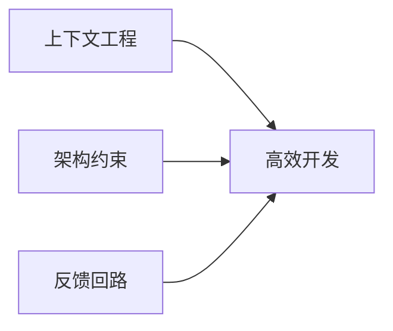

# Harness Engineering 最佳实践

> **基于 OpenAI 官方最佳实践**  
> **适用范围**: OPC-HARNESS 项目全体开发者和 AI Agent  
> **最后更新**: 2026-03-23  
> **状态**: 🟢 已优化  
> **版本**: v2.0

---

## 📑 目录

- [核心理念](#-核心理念)
- [如何向 AI 提问](#-如何向 ai-提问)
- [代码验证流程](#-代码验证流程)
- [TypeScript 最佳实践](#typescript-最佳实践)
- [Rust 最佳实践](#rust-最佳实践)
- [架构约束](#-架构约束)
- [提交前检查清单](#-提交前检查清单)
- [常见陷阱](#-常见陷阱与解决方案)

---

## 🎯 核心理念

**Harness Engineering** 是一套让 AI Agent 更好地协助你开发项目的工程实践体系。

### 核心理念

> **"人类掌舵，Agent 执行"** (Humans steer. Agents execute.)

### 三大支柱



1. **上下文工程 (Context Engineering)** - 帮助 AI 快速理解项目
   - 清晰的代码结构
   - 完善的文档注释
   - 一致的命名规范

2. **架构约束 (Architectural Constraints)** - 确保代码符合规范
   - 分层架构
   - 依赖方向
   - 职责分离

3. **反馈回路 (Feedback Loops)** - 快速发现问题并持续改进
   - 自动化测试
   - 代码审查
   - 持续集成

---

## 📖 如何向 AI 提问

### ✅ 好的提问方式

```markdown
**任务**: 实现用户登录功能

**上下文**:
- 位置：src/components/auth/Login.tsx
- 已有：数据库连接、User 模型
- 需要：登录、注册、登出组件

**约束**:
- 使用 bcrypt 加密密码
- JWT token 有效期 7 天
- 错误信息使用中文
- 遵循 src/AGENTS.md 规范

**参考示例**:
参考 src/components/common/Settings.tsx 的实现模式

**验收标准**:
- [ ] 用户可以成功登录
- [ ] 错误密码有友好提示
- [ ] Token 正确存储和刷新
```

### ❌ 避免的提问方式

```markdown
❌ "帮我写个登录功能"
❌ "这个怎么弄？"
❌ "代码不工作了，帮我看看"
```

### 💡 提问模板

复制以下模板用于日常开发：

```markdown
**任务**: [简短描述]

**上下文**:
- 位置：[文件路径]
- 已有：[现有代码/功能]
- 需要：[期望实现]

**约束**:
- [技术栈要求]
- [性能要求]
- [安全要求]

**参考**:
- [参考文件/代码]
- [相关文档链接]

**验收标准**:
- [ ] [标准 1]
- [ ] [标准 2]
```

---

## 🧪 AI 生成代码验证流程

### 完整验证流程

```bash
# 1. 类型检查
npx tsc --noEmit

# 2. 代码规范检查
npm run lint

# 3. 格式化
npm run format

# 4. 架构健康检查（强烈推荐）
npm run harness:check

# 5. 运行单元测试
npm run test:unit

# 6. 手动审查关键点
```

### 审查清单

```markdown
## 代码质量
- [ ] TypeScript 无类型错误
- [ ] ESLint 无警告
- [ ] Prettier 格式化通过
- [ ] Rust cargo check 通过

## 功能完整性
- [ ] 核心功能已测试
- [ ] 边界情况已处理
- [ ] 错误提示友好（中文）
- [ ] 加载状态正确显示

## 测试覆盖
- [ ] 新增代码有对应测试
- [ ] 单元测试覆盖率 >= 70%
- [ ] E2E 测试通过

## 文档
- [ ] 更新了必要的注释
- [ ] 记录了架构决策（如需要）
- [ ] 更新了最佳实践（如有新经验）

## 性能和安全
- [ ] 无明显性能问题
- [ ] 敏感数据加密存储
- [ ] API Key 不硬编码
- [ ] 输入验证完整
```

---

## 📝 TypeScript 最佳实践

### 空值安全

#### ✅ 推荐模式

```typescript
// 1. 显式检查后操作
{(() => {
  const provider = providers.find(p => p.id === config.provider);
  if (!provider?.supportedModels) return null;
  return provider.supportedModels.map(item => (
    <Component key={item} />
  ));
})()}

// 2. 类型守卫
function isDefined<T>(value: T | undefined | null): value is T {
  return value !== undefined && value !== null;
}

const validItems = items.filter(isDefined);

// 3. 使用默认值
const count = items?.length ?? 0;

// 4. 可选链 + 空值合并
const name = user?.profile?.name ?? '匿名用户';
```

#### ❌ 避免模式

```typescript
// ❌ 仅依赖可选链（可能返回 undefined）
{providers.find(p => p.id === id)?.supportedModels.map(...)}

// ❌ 无条件渲染
{items.map(item => <Item key={item.id} {...item} />)}
// items 可能为 undefined

// ❌ 过度嵌套的可选链
user?.profile?.settings?.notifications?.email // 超过 3 层
```

### 类型定义

#### ✅ 推荐模式

```typescript
// 1. 使用 interface 定义对象类型
interface User {
  id: string;
  name: string;
  email?: string;
}

// 2. 使用 type 定义联合类型
type Status = 'pending' | 'loading' | 'success' | 'error';

// 3. 使用泛型提高复用性
interface ApiResponse<T> {
  data: T;
  status: number;
  message: string;
}

// 4. 明确的函数返回类型
async function fetchUser(id: string): Promise<User | null> {
  // ...
}
```

### React Hooks

```typescript
// ✅ 正确的 Hooks 使用
function MyComponent({ userId }: { userId: string }) {
  // 条件在 Hooks 之前
  if (!userId) {
    return <div>请先选择用户</div>;
  }

  // Hooks 调用
  const [data, setData] = useState<User | null>(null);
  const { isLoading, error } = useFetchUser(userId);

  // 事件处理
  const handleClick = useCallback(() => {
    // 处理逻辑
  }, []);

  return <div>{/* ... */}</div>;
}
```

---

## 🦀 Rust 最佳实践

### 错误处理

#### ✅ 推荐模式

```rust
// 1. 使用 Result 传递错误
#[tauri::command]
pub async fn create_project(
    name: String,
    description: Option<String>,
) -> Result<Project, String> {
    if name.trim().is_empty() {
        return Err("项目名称不能为空".to_string());
    }

    let project = Project::new(&name, &description)
        .map_err(|e| format!("创建项目失败：{}", e))?;

    Ok(project)
}

// 2. 提供友好的错误信息
match api_call.await {
    Ok(response) => Ok(response),
    Err(e) => Err(format!(
        "AI 服务调用失败：{}。请检查 API Key 配置和网络连接",
        e
    )),
}

// 3. 使用 ? 操作符简化
let file = File::open(path)?;
let content = read_to_string(file)?;
Ok(content)

// 4. 自定义错误类型
#[derive(Debug)]
enum AppError {
    DatabaseError(String),
    ValidationError(String),
    ExternalServiceError(String),
}

impl fmt::Display for AppError {
    fn fmt(&self, f: &mut fmt::Formatter) -> fmt::Result {
        match self {
            AppError::DatabaseError(msg) => write!(f, "数据库错误：{}", msg),
            AppError::ValidationError(msg) => write!(f, "验证失败：{}", msg),
            AppError::ExternalServiceError(msg) => {
                write!(f, "外部服务错误：{}", msg)
            }
        }
    }
}
```

#### ❌ 避免模式

```rust
// ❌ unwrap() 滥用
let file = File::open(path).unwrap(); // 可能 panic

// ❌ 模糊的错误信息
Err("Error occurred".to_string()) // 用户不知道如何解决

// ❌ 忽略错误
let _ = some_operation(); // 错误被丢弃

// ❌ 过度嵌套的 match
match result {
    Ok(value) => match process(value) {
        Ok(final_value) => Ok(final_value),
        Err(e) => Err(e),
    },
    Err(e) => Err(e),
}
// 应该使用 ? 操作符或 and_then()
```

### 内存管理

```rust
// ✅ 推荐：使用引用避免不必要的克隆
fn process_data(data: &[String]) -> Vec<String> {
    data.iter()
        .map(|s| s.to_uppercase())
        .collect()
}

// ✅ 推荐：使用 Cow 避免不必要的分配
use std::borrow::Cow;

fn sanitize_input(input: &str) -> Cow<str> {
    if input.contains('<') {
        Cow::Owned(input.replace('<', "&lt;"))
    } else {
        Cow::Borrowed(input)
    }
}
```

---

## 🏗️ 架构约束

### 前端数据流规则

```typescript
// ✅ 推荐：单向数据流
Component → Store → Commands → Services → DB
     ↑                                       |
     └─────────── State Update ←─────────────┘

// ❌ 禁止：
// - 组件直接调用 invoke() - 必须通过 stores 封装
// - Store 直接操作 DOM
// - 循环依赖：stores → components → stores
```

### 后端分层规则

```rust
// ✅ 允许：
Commands → Services → Models → DB
                ↑
            Business Logic

// ❌ 禁止：
// - Commands 包含复杂业务逻辑
// - Services 直接返回前端（必须通过 Commands）
// - 循环依赖：commands ↔ services
```

### 详细规则

请参考：[architecture-rules.md](./architecture-rules.md)

---

## 🔧 常见陷阱与解决方案

### 陷阱 1: 在组件中直接调用 Tauri API

```typescript
// ❌ 错误
function MyComponent() {
  const handleSave = async () => {
    await invoke('save_project', { data });
  };
}

// ✅ 正确
// stores/projectStore.ts
export const useProjectStore = create((set) => ({
  saveProject: async (data) => {
    await invoke('save_project', { data });
    set({ lastSaved: new Date() });
  }
}));

// components/MyComponent.tsx
function MyComponent() {
  const { saveProject } = useProjectStore();
  const handleSave = () => saveProject(data);
}
```

**原因**: 
- 保持组件纯净，便于测试
- 统一错误处理
- 便于状态追踪

### 陷阱 2: 在 Commands 中包含业务逻辑

```rust
// ❌ 错误
#[tauri::command]
pub async fn create_project(name: String) -> Result<Project, String> {
    // 30+ 行代码，包含验证、数据库操作、日志记录等
    if name.is_empty() { return Err("..."); }
    let project = Project::new(...);
    db.save(&project).await?;
    log::info!("...");
    // ... 更多逻辑
    Ok(project)
}

// ✅ 正确
#[tauri::command]
pub async fn create_project(name: String) -> Result<Project, String> {
    project_service::create_project(name).await
}

// services/project_service.rs
pub async fn create_project(name: String) -> Result<Project, AppError> {
    validate_project_name(&name)?;
    let project = Project::new(&name)?;
    save_project_to_db(&project).await?;
    log_project_creation(&project);
    Ok(project)
}
```

**原因**:
- Commands 层保持简洁（< 30 行）
- 业务逻辑集中在 Services 层
- 便于单元测试

### 陷阱 3: 忽视异步错误处理

```typescript
// ❌ 错误
const handleSave = async () => {
  await saveData(); // 没有 try-catch
};

// ✅ 正确
const handleSave = async () => {
  try {
    await saveData();
    showSuccess('保存成功');
  } catch (error) {
    showError(error instanceof Error ? error.message : '保存失败');
  }
};
```

---

## 📚 参考资源

### 推荐阅读

- [OpenAI Harness Engineering](https://openai.com/index/harness-engineering/)
- [TypeScript 官方手册](https://www.typescriptlang.org/docs/)
- [Rust Book](https://doc.rust-lang.org/book/)
- [React 最佳实践](https://react.dev/learn)

### 项目相关

- [AGENTS.md](../../AGENTS.md) - AI Agent 导航地图
- [architecture-rules.md](./architecture-rules.md) - 架构约束规则
- [产品设计.md](./产品设计.md) - 产品需求文档

---

**维护者**: OPC-HARNESS Team  
**贡献者**: 欢迎提交 PR 改进最佳实践  
**许可证**: 同项目主许可证
