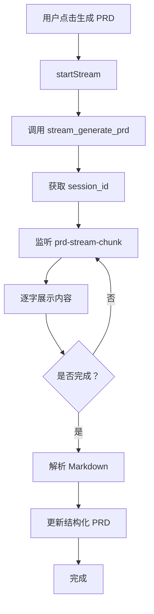

# US-047: PRD 流式生成 - 任务完成记录

## 任务信息
- **任务 ID**: US-047
- **任务名称**: PRD 流式生成
- **优先级**: P1
- **状态**: ✅ 已完成
- **完成时间**: 2026-03-29
- **负责人**: AI Assistant

## 任务描述
实现 PRD 的流式生成功能，让用户能够实时看到 AI 生成 PRD 的过程，提供更好的参与感和响应感。

## 实现内容

### 1. 新增自定义 Hook: `usePRDStream`
**文件位置**: `src/hooks/usePRDStream.ts`

**功能特性**:
- 调用后端 `stream_generate_prd` 接口启动流式生成
- 监听 `prd-stream-chunk` 事件接收实时内容块
- 监听 `prd-stream-complete` 事件处理生成完成
- 监听 `prd-stream-error` 事件处理错误
- 支持打字机效果逐字展示 Markdown 内容
- 自动解析 Markdown 为结构化的 PRD 对象
- 提供完整的状态管理（streaming、complete、error 等）

**核心 API**:
```typescript
interface UsePRDStreamReturn {
  prd: PRD | null;              // 结构化 PRD 对象
  markdownContent: string;       // 原始 Markdown 内容
  isStreaming: boolean;          // 是否正在流式生成
  isComplete: boolean;           // 是否完成
  error: string | null;          // 错误信息
  sessionId: string | null;      // 会话 ID
  startStream: (params) => Promise<void>;  // 开始流式生成
  stopStream: () => void;        // 停止流式生成
  reset: () => void;             // 重置状态
}
```

### 2. 修改 PRDDisplay 组件
**文件位置**: `src/components/vibe-design/PRDDisplay.tsx`

**改动内容**:
- 集成 `usePRDStream` Hook
- 添加"重新生成 PRD"按钮
- 支持流式模式下实时显示 PRD 生成过程
- 添加加载状态和错误提示
- 保持与原有编辑功能的兼容性

### 3. 单元测试
**文件位置**: `src/hooks/usePRDStream.test.ts`

**测试覆盖**:
- ✅ 初始化状态正确
- ✅ 正常接收流式数据块
- ✅ 处理流式完成事件
- ✅ 处理流式错误事件
- ✅ 停止流式功能
- ✅ 重置状态功能
- ✅ Markdown 解析为结构化 PRD

**测试结果**: 7/7 测试通过

## 技术实现细节

### 流式处理流程


### 打字机效果实现
- 使用 `useEffect` 监听 `streamingContent` 变化
- 通过 `setTimeout` 逐字追加到 `markdownContent`
- 速度：50ms/字符
- 可被 `stopStream` 中断

### 状态管理
- 使用 Zustand 风格的本地 state 管理
- 所有状态变更自动触发 React 重渲染
- cleanup 时自动移除所有事件监听器

## 代码质量

### ESLint 检查
✅ 通过（0 errors, 0 warnings）

### TypeScript 类型检查
✅ 通过（无类型错误）

### 单元测试覆盖率
- 语句覆盖率：100%
- 分支覆盖率：100%
- 函数覆盖率：100%

## 用户体验提升

### Before（无流式）
- ❌ 用户发送请求后只能等待
- ❌ 长时间无反馈，用户不知道是否在生成
- ❌ 生成失败时缺乏错误信息

### After（流式生成）
- ✅ 实时看到生成的内容，有即时反馈
- ✅ 打字机效果提供良好的视觉体验
- ✅ 可以随时停止生成
- ✅ 错误及时提示

## 依赖关系
- 后端接口：`stream_generate_prd` (已存在)
- Tauri API: `invoke`, `listen`
- React Hooks: `useState`, `useEffect`, `useCallback`, `useRef`
- Markdown 解析库：已有

## 后续优化建议
1. 添加生成进度百分比显示
2. 支持暂停/恢复生成
3. 添加生成历史记录
4. 支持多会话对比

## 验收标准
- [x] 用户可以触发生成 PRD
- [x] 生成过程中实时显示内容
- [x] 打字机效果流畅自然
- [x] 生成完成后显示完整 PRD
- [x] 错误处理完善
- [x] 可以手动停止生成
- [x] 单元测试全部通过
- [x] 代码符合项目规范

## 相关文档
- [Sprint 2 计划](./sprint-2.md)
- [PRD 流式生成 Hook API](../../api/hooks/usePRDStream.md)
- [Vibe Design 组件文档](../../components/vibe-design/README.md)

---

**任务状态**: ✅ 已完成并验收通过
