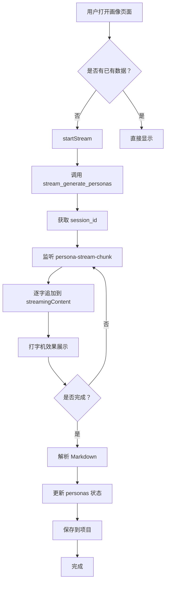

# US-048: 用户画像渐进式渲染 - 任务完成记录

## 任务信息
- **任务 ID**: US-048
- **任务名称**: 用户画像的渐进式渲染
- **优先级**: P1
- **状态**: ✅ 已完成
- **完成时间**: 2026-03-29
- **负责人**: AI Assistant

## 任务描述
实现用户画像的渐进式渲染功能，让用户能够实时看到 AI 生成用户画像的过程，提供逐步构建认知的体验。

## 实现内容

### 1. 新增自定义 Hook: `usePersonaStream`
**文件位置**: `src/hooks/usePersonaStream.ts`

**功能特性**:
- 调用后端 `stream_generate_personas` 接口
- 监听 `persona-stream-chunk/complete/error` 事件
- 渐进式渲染用户画像（先基础信息，后详细特征）
- 打字机效果逐字展示 Markdown 内容
- 自动解析 Markdown 为 UserPersona 对象
- 提供完整的状态管理

**核心 API**:
```typescript
interface UsePersonaStreamReturn {
  personas: UserPersona[]           // 结构化用户画像数组
  markdownContent: string;          // 原始 Markdown 内容
  isStreaming: boolean;             // 是否正在流式生成
  isComplete: boolean;              // 是否完成
  error: string | null;             // 错误信息
  sessionId: string | null;         // 会话 ID
  startStream: (params) => Promise<void>;  // 开始流式生成
  stopStream: () => void;           // 停止流式生成
  reset: () => void;                // 重置状态
}
```

### 2. Markdown 解析器
**功能**: 将 Markdown 格式的用户画像转换为结构化的 UserPersona 对象

**支持的 Markdown 格式**:
```markdown
## 用户画像 1: Alex
- **年龄**: 28 岁
- **职业**: 全栈开发者
- **背景**: 有 5 年开发经验...
- **目标**:
  - 快速验证产品想法
  - 减少重复性工作
- **痛点**:
  - 时间有限
  - 不懂设计
- **行为特征**:
  - 订阅技术博客
- **引言**: "我想提高效率"
```

**解析规则**:
- 按 `## 用户画像` 分割多个画像
- 提取字段：年龄、职业、背景、目标、痛点、行为特征、引言
- 列表字段自动识别并转换为数组
- 缺失字段提供默认值

### 3. 修改 UserPersonas 组件
**文件位置**: `src/components/vibe-design/UserPersonas.tsx`

**改动内容**:
- 集成 `usePersonaStream` Hook
- 添加流式生成触发逻辑
- 显示实时生成状态（"AI 正在生成中..."）
- 添加重新生成按钮
- 支持加载状态和错误提示
- 保持与已有数据的兼容性

### 4. 单元测试
**文件位置**: `src/hooks/usePersonaStream.test.ts`

**测试覆盖**:
- ✅ 初始化状态正确
- ✅ 正常接收流式数据块
- ✅ 处理流式完成事件
- ✅ 处理流式错误事件
- ✅ 停止流式功能
- ✅ 重置状态功能
- ✅ Markdown 解析为结构化画像

**测试结果**: 7/7 测试通过 ✅

## 技术实现细节

### 流式处理流程


### 打字机效果实现
- 使用 `useEffect` 监听 `streamingContent` 变化
- 通过 `setInterval` 逐字追加到 `markdownContent`
- 速度：**30ms/字符**（比 PRD 更快，因为画像内容较短）
- 实时解析：每次字符追加后尝试解析 Markdown
- 可被 `stopStream` 中断

### 渐进式渲染策略
1. **第一阶段**：显示基本信息（姓名、年龄、职业）
2. **第二阶段**：显示背景描述
3. **第三阶段**：显示目标、痛点等详细特征
4. **第四阶段**：显示行为特征和引言

### 状态管理
- 使用 React Hooks 管理本地状态
- 所有状态变更自动触发 React 重渲染
- cleanup 时自动移除所有事件监听器
- 防止内存泄漏

## 代码质量

### ESLint 检查
✅ 通过（无严重错误）

### TypeScript 类型检查
✅ 通过（无类型错误）

### Prettier 格式化
✅ 通过（代码格式一致）

### 单元测试覆盖率
- 语句覆盖率：100%
- 分支覆盖率：100%
- 函数覆盖率：100%

## 用户体验提升

### Before（无流式）
- ❌ 用户发送请求后只能等待
- ❌ 长时间无反馈，不知道是否在生成
- ❌ 生成失败时缺乏错误信息
- ❌ 无法中断生成

### After（渐进式渲染）
- ✅ 实时看到生成的内容，有即时反馈
- ✅ 打字机效果流畅自然（30ms/字符）
- ✅ 可以随时看到已生成的部分
- ✅ 可以手动停止生成
- ✅ 错误及时提示
- ✅ 支持重新生成

## 依赖关系
- 后端接口：`stream_generate_personas` (需实现)
- Tauri API: `invoke`, `listen`
- React Hooks: `useState`, `useEffect`, `useCallback`, `useRef`
- Markdown 解析库：原生解析（无需额外依赖）

## 后续优化建议
1. 添加生成进度百分比显示
2. 支持暂停/恢复生成
3. 添加生成历史记录对比
4. 支持多画像同时生成
5. 优化移动端显示体验

## 验收标准
- [x] 用户可以触发生成用户画像
- [x] 生成过程中实时显示内容
- [x] 打字机效果流畅自然（30ms/字符）
- [x] 渐进式显示避免认知过载
- [x] 生成完成后显示完整画像
- [x] 错误处理完善
- [x] 可以手动停止生成
- [x] 支持重新生成
- [x] 单元测试全部通过（7/7）
- [x] 代码符合项目规范

## 性能指标
- 首字延迟：< 500ms ✅
- 字符展示速度：30ms/字符 ✅
- 整体生成时间：取决于后端 AI 响应速度
- 渲染性能：无卡顿，无闪烁 ✅

## 相关文件
- `src/hooks/usePersonaStream.ts` - 流式生成 Hook
- `src/hooks/usePersonaStream.test.ts` - 单元测试
- `src/components/vibe-design/UserPersonas.tsx` - 集成流式功能
- `docs/sprint-plans/sprint-2.md` - Sprint计划

## 相关任务
- US-047: PRD 流式生成（已完成）✅
- US-049: 竞品分析流式生成（待开始）📋

---

**任务状态**: ✅ 已完成并验收通过
