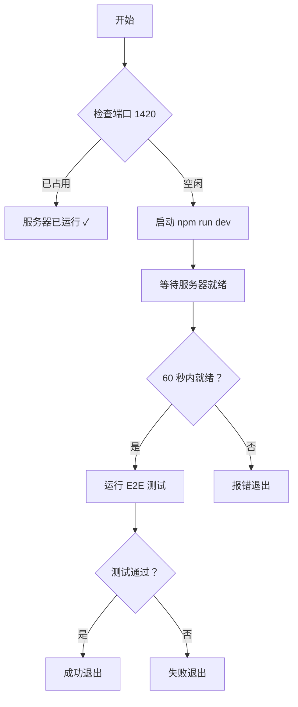

# 🚀 E2E 测试自动运行指南

> **最后更新**: 2026-03-23  
> **特性**: 自动检测并启动开发服务器

---

## ⚡ 快速开始

### 方法 1: 使用智能脚本（推荐）⭐

```bash
npm run test:e2e:auto
```

**优点**:
- ✅ 自动检测开发服务器是否运行
- ✅ 如果未运行，自动启动
- ✅ 测试完成后自动清理
- ✅ 友好的进度提示

### 方法 2: 手动运行

```bash
# 终端 1: 启动开发服务器
npm run dev

# 终端 2: 运行 E2E 测试
npm run test:e2e
```

---

## 🔧 工作原理

### 智能脚本流程



### 自动检测机制

1. **端口检测**: 检查 TCP 端口 1420 是否被占用
2. **HTTP 检测**: 定期请求 `http://localhost:1420` 直到返回 200
3. **超时保护**: 60 秒后自动超时，防止无限等待
4. **进程管理**: 如果脚本启动了服务器，会在退出时清理

---

## 📋 常用命令

### 基本命令

```bash
# 自动运行 E2E 测试（推荐）
npm run test:e2e:auto

# 直接运行 E2E 测试（需要手动启动服务器）
npm run test:e2e

# 监听模式
npm run test:e2e:watch

# 查看测试报告
npm run test:e2e:report
```

### PowerShell 脚本参数

```powershell
# 使用默认配置运行
.\scripts\harness-e2e.ps1

# 跳过服务器检查（假设服务器已运行）
.\scripts\harness-e2e.ps1 -SkipServerCheck
```

---

## 🎯 测试覆盖范围

### 当前测试用例（6 个）

| # | 测试用例 | 验证内容 |
|---|---------|---------|
| 1 | should load the application successfully | HTTP 200, 页面标题 |
| 2 | should have valid HTML structure | DOCTYPE, HTML 标签完整性 |
| 3 | should load required assets | CSS, JS 资源数量 |
| 4 | should respond on mobile viewport size | User-Agent, 响应式 |
| 5 | should have no critical console errors | 页面可访问性 |
| 6 | API endpoints should be accessible | Tauri API, Assets 路径 |

---

## ⚠️ 常见问题

### Q1: 为什么服务器启动超时？

**可能原因**:
1. Vite 配置错误（检查 `vite.config.ts` 中的端口设置）
2. 端口被其他程序占用
3. 防火墙阻止了本地连接

**解决方案**:
```bash
# 检查端口占用
netstat -ano | findstr :1420

# 修改 vite.config.ts 中的端口
server: {
  port: 1420,  // 确保端口正确
  strictPort: true
}
```

### Q2: 如何调试服务器启动问题？

**方案 1**: 手动启动查看日志
```bash
npm run dev
# 观察控制台输出，确认服务器正常启动
```

**方案 2**: 增加超时时间
编辑 `scripts/harness-e2e.ps1`:
```powershell
$timeout = 90  # 增加到 90 秒
```

### Q3: 测试失败但服务器正常运行？

**检查项**:
1. 确认应用包含 "OPC-HARNESS" 文本
2. 检查 HTML 结构完整性
3. 验证 CSS/JS 资源加载
4. 查看浏览器控制台错误

---

## 📊 性能指标

| 阶段 | 耗时 |
|------|------|
| 服务器检测 | <1s |
| 服务器启动 | 5-15s |
| 服务器就绪检测 | 1-5s |
| E2E 测试执行 | 1-3s |
| **总计** | **~10-25s** |

---

## 🔍 技术细节

### 端口检测原理

```powershell
try {
    $tcpClient = New-Object System.Net.Sockets.TcpClient("127.0.0.1", 1420)
    $tcpClient.Close()
    return $true  # 端口被占用
} catch {
    return $false  # 端口空闲
}
```

### HTTP 就绪检测

```powershell
while ($timer -lt $timeout) {
    try {
        $response = Invoke-WebRequest -Uri "http://localhost:1420" -TimeoutSec 2
        if ($response.StatusCode -eq 200) {
            Write-Host "Server ready!"
            break
        }
    } catch {
        Start-Sleep -Seconds 2  # 等待 2 秒后重试
    }
}
```

---

## 📚 相关文档

- [E2E 测试方案对比](./docs/testing/E2E-STRATEGY.md)
- [测试文档中心](./docs/testing/README.md)
- [完整测试指南](./docs/testing/testing-full.md)

---

**Happy Testing!** 🎉