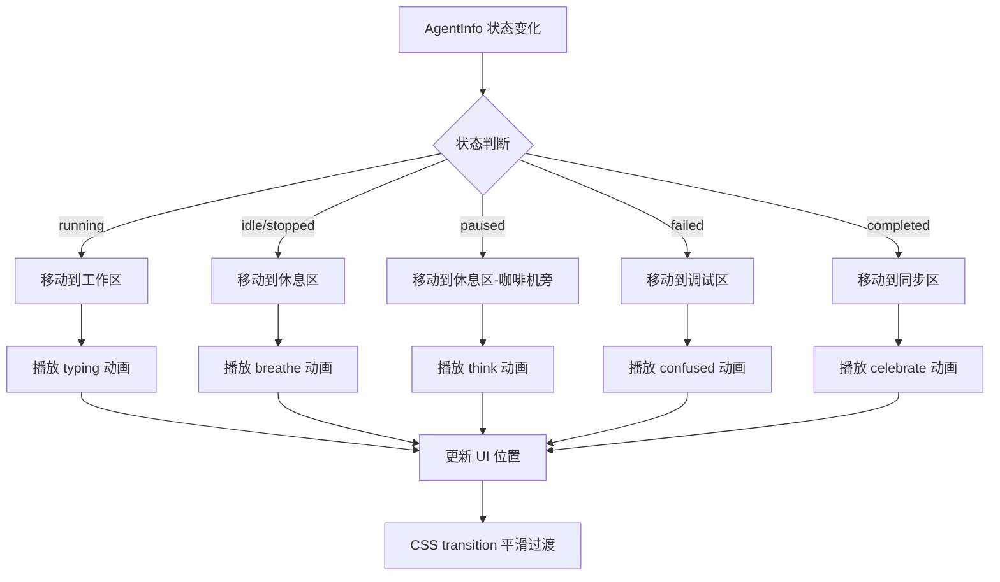

# Vibe Coding 拟人化像素动画功能

## 📋 概述

Vibe Coding 智能体监控面板现已支持**拟人化像素动画**展示,参考 [Star-Office-UI](https://github.com/ringhyacinth/Star-Office-UI) 设计风格,将抽象的 AI Agent 工作状态转化为生动有趣的像素办公室场景。

## ✨ 核心特性 (Star-Office-UI 风格优化版)

### 1. **俯视角像素办公室布局**
- **4 大功能区域**:
  - 🖥️ **工作区** (左上): AI 正在执行任务,显示办公桌和键盘
  - ☕ **休息区** (右上): AI 待命或暂停中,显示沙发和咖啡机
  - 🐛 **调试区** (左下): AI 遇到错误需要排查,显示服务器机柜
  - 💾 **同步区** (右下): AI 已完成任务,显示文件柜

- **绝对定位系统**: 智能体根据状态自动移动到对应区域的特定位置,支持平滑过渡动画

### 2. **增强的像素角色动画**
- **6 种状态动画** (每状态 2-4 帧):
  - `idle-breathe`: 空闲呼吸,轻微上下浮动
  - `running-type`: 运行中打字,手部快速移动 + 键盘闪烁
  - `paused-think`: 暂停思考,头顶出现思考泡泡 "T"
  - `completed-celebrate`: 完成庆祝,跳跃动作 + 金色星星特效 "*"
  - `failed-confused`: 失败困惑,眼睛变成 XX,头顶问号 "?"
  - `walking`: 行走移动,腿部交替摆动

- **3 种智能体类型主题**:
  - 🔵 **Initializer** (蓝色): 初始化 Agent,戴安全帽
  - 🟢 **Coding** (绿色): 编码 Agent,戴眼镜
  - 🟣 **MR Creation** (紫色): MR 创建 Agent,拿文件夹

### 3. **办公室装饰元素** ([OfficeDecorations.tsx](file://d:\workspace\opc-harness\src\components\vibe-coding\OfficeDecorations.tsx))
- **像素家具组件**:
  - 🪑 办公桌 (Desk): 带键盘和显示器
  - 🛋️ 沙发 (Sofa): 舒适的休息座椅
  - 🖥️ 服务器机柜 (Server): 带指示灯和屏幕
  - 🗄️ 文件柜 (Cabinet): 多层抽屉设计
  - 🌿 盆栽 (Plant): 装饰植物
  - ☕ 咖啡机 (Coffee): 休息区专属装饰

- **半透明叠加**: 家具以 30-40% 透明度作为背景装饰,不干扰角色查看

### 4. **顶部信息栏** (Star-Office-UI 风格)
- **实时时钟**: 显示当前时间和日期
- **智能体统计**: 总数、工作中数量
- **📝 昨日小记**: 自动生成昨天的工作总结
  - ✅ 完成任务数
  - ⚠️ 遇到错误数
  - 🔄 仍在工作中数

### 5. **交互增强**
- **悬停信息卡片**: 鼠标悬停显示智能体名称、任务、进度条
- **点击详情弹窗**: 使用 Dialog 组件展示:
  - 运行日志 (带行号)
  - 资源使用 (CPU、内存、进度可视化)
  - 基本信息 (ID、类型、会话、状态)
- **快速操作按钮**: 悬停时显示暂停/恢复/停止按钮

### 6. **响应式设计**
- **桌面端** (>1024px): 2x2 网格布局,完整展示 4 个区域
- **平板端** (768-1024px): 2x2 网格,缩小间距
- **移动端** (<768px): 单列垂直排列,保持可读性

## 🏗️ 技术架构

### 核心组件

#### 1. [PixelAvatar.tsx](file://d:\workspace\opc-harness\src\components\vibe-coding\PixelAvatar.tsx) - 像素角色组件
```typescript
// Canvas 绘制 16x16 像素网格
const CHARACTER_BASE = [
  [' ', ' ', 'H', 'H', 'H', 'H', ' ', ' ', ...], // 头部
  [' ', 'H', 'H', 'W', 'W', 'H', 'H', ' ', ...], // 眼睛
  ...
]

// 帧动画系统 (8 FPS)
useEffect(() => {
  const interval = setInterval(() => {
    setCurrentFrame((prev) => (prev + 1) % frames.length)
  }, 125) // 1000ms / 8fps = 125ms
  return () => clearInterval(interval)
}, [frames])
```

**关键技术点**:
- Canvas API 逐像素绘制
- CSS `image-rendering: pixelated` 保持清晰边缘
- `requestAnimationFrame` 实现流畅动画
- 特殊符号颜色映射 (W=白色眼睛, K=黄色键盘, *=金色星星等)

#### 2. [AgentOffice.tsx](file://d:\workspace\opc-harness\src\components\vibe-coding\AgentOffice.tsx) - 办公室场景组件
```typescript
// 智能体位置计算 (基于状态)
const getAgentPosition = (agent: AgentInfo, index: number): AgentPosition => {
  const offset = index * 15 // 同区域内偏移
  switch (agent.status) {
    case 'running': return { zone: 'work', x: 20 + offset, y: 30 }
    case 'idle': return { zone: 'rest', x: 70 + offset, y: 20 }
    case 'failed': return { zone: 'debug', x: 20 + offset, y: 70 }
    ...
  }
}

// 绝对定位渲染
<div
  className="absolute transition-all duration-500 ease-in-out"
  style={{ left: `${position.x}%`, top: `${position.y}%` }}
>
  <PixelAvatar agent={agent} />
</div>
```

**关键技术点**:
- 百分比定位系统 (0-100%)
- CSS `transition-all duration-500` 实现平滑移动
- 按状态分组渲染
- Dialog 弹窗替代 Tabs (修复类型错误)

#### 3. [OfficeDecorations.tsx](file://d:\workspace\opc-harness\src\components\vibe-coding\OfficeDecorations.tsx) - 家具装饰组件
```typescript
// 16x16 像素家具图案
const FURNITARY_PATTERNS = {
  desk: [
    [' ', ' ', 'D', 'D', 'D', ...], // D=深棕色木材
    [' ', 'D', 'D', 'D', 'D', ...],
    ['D', 'W', 'W', 'W', 'W', ...], // W=浅棕色桌面
    ...
  ],
  ...
}

// Canvas 渲染家具
export function PixelFurniture({ type, size = 64 }) {
  const canvasRef = useRef<HTMLCanvasElement>(null)
  useEffect(() => {
    const ctx = canvasRef.current.getContext('2d')
    pattern.forEach((row, y) => {
      row.forEach((colorKey, x) => {
        if (colorKey && FURNITARY_COLORS[colorKey]) {
          ctx.fillStyle = FURNITARY_COLORS[colorKey]
          ctx.fillRect(x * pixelSize, y * pixelSize, pixelSize, pixelSize)
        }
      })
    })
  }, [type, size])
  
  return <canvas ref={canvasRef} width={size} height={size} />
}
```

**关键技术点**:
- 独立的 Canvas 渲染避免重绘角色
- 低透明度 (opacity: 0.3-0.4) 作为背景
- `pointer-events-none` 防止遮挡交互

### 状态管理流程



## 📁 文件结构

```
src/components/vibe-coding/
├── PixelAvatar.tsx              # 像素角色组件 (核心动画)
├── AgentOffice.tsx              # 办公室场景组件 (主容器)
├── OfficeDecorations.tsx        # 家具装饰组件 (新增)
├── AgentMonitor.tsx             # 智能体监控面板 (集成视图切换)
└── PIXEL_AVATAR_FEATURE.md      # 功能文档 (本文件)
```

## 🎨 设计规范

### 颜色调色板
```typescript
// 角色基础色
const TYPE_COLORS = {
  initializer: '#3B82F6', // 蓝色
  coding: '#10B981',      // 绿色
  mr_creation: '#8B5CF6', // 紫色
}

// 特殊符号色
const SPECIAL_COLORS = {
  W: '#FFFFFF',   // 白色眼睛
  M: '#FF6B6B',   // 红色嘴巴
  K: '#FFD93D',   // 黄色键盘
  T: '#87CEEB',   // 天蓝思考泡泡
  X: '#FF0000',   // 红色错误叉号
  '?': '#FFA500', // 橙色问号
  '*': '#FFD700', // 金色星星
  L: '#8B4513',   // 棕色腿部
}

// 家具色
const FURNITARY_COLORS = {
  D: '#8B4513',   // 深棕色木材
  W: '#DEB887',   // 浅棕色桌面
  S: '#4682B4',   // 钢蓝色沙发
  R: '#2C3E50',   // 深灰色服务器
  G: '#27AE60',   // 绿色指示灯
  ...
}
```

### 动画参数
- **帧率**: 8 FPS (每帧 125ms)
- **过渡时长**: 500ms (CSS `duration-500`)
- **缓动函数**: `ease-in-out`
- **循环模式**: 无限循环 (除 celebrate 外)

### 响应式断点
```css
/* 移动端 */
@media (max-width: 767px) {
  grid-template-columns: 1fr; /* 单列 */
}

/* 平板端 */
@media (min-width: 768px) and (max-width: 1023px) {
  grid-template-columns: repeat(2, 1fr); /* 双列 */
}

/* 桌面端 */
@media (min-width: 1024px) {
  grid-template-columns: repeat(2, 1fr); /* 双列,更大间距 */
}
```

## 🚀 使用方法

### 基本用法
```tsx
import { AgentMonitor } from '@/components/vibe-coding/AgentMonitor'

function App() {
  return <AgentMonitor agents={agents} loading={false} />
}
```

### 视图切换
在 AgentMonitor 顶部选择:
- **🏢 办公室视图**: 进入拟人化像素办公室
- **📋 列表视图**: 传统卡片列表 (保留原有功能)

### 交互操作
1. **悬停角色**: 查看快速信息卡片
2. **点击角色**: 打开详细日志和资源使用弹窗
3. **快速操作**: 悬停时点击暂停/恢复/停止按钮

## 🔧 自定义扩展

### 添加新状态动画
```typescript
// 1. 在 PixelAvatar.tsx 中添加帧定义
const ANIMATION_FRAMES = {
  // ... existing code ...
  'new-state': [
    CHARACTER_BASE,
    CHARACTER_BASE.map(row => /* 修改逻辑 */),
    // 更多帧...
  ],
}

// 2. 在状态映射中添加
const getStateAnimation = (status: string): PixelAvatarState => {
  switch (status) {
    // ... existing code ...
    case 'new_status': return 'new-state'
  }
}
```

### 添加新家具类型
```typescript
// 在 OfficeDecorations.tsx 中添加
const FURNITARY_PATTERNS = {
  // ... existing code ...
  newFurniture: [
    [' ', ' ', 'X', 'X', ...],
    // 16x16 像素图案
  ],
}

const FURNITARY_COLORS = {
  // ... existing code ...
  X: '#COLOR_CODE',
}
```

### 调整区域布局
```typescript
// 在 AgentOffice.tsx 中修改位置配置
const getAgentPosition = (agent, index) => {
  switch (agent.status) {
    case 'running':
      return { zone: 'work', x: 30 + index * 10, y: 25 } // 调整坐标
    // ...
  }
}
```

## 📊 性能优化

### 渲染优化
1. **Canvas 独立渲染**: 每个角色和家具使用独立 Canvas,避免全局重绘
2. **CSS 硬件加速**: 使用 `transform` 和 `opacity` 触发 GPU 加速
3. **非激活角色暂停**: 不在视口内的角色可暂停动画 (未来优化)

### 内存优化
1. **帧缓存**: 预计算所有帧数据,避免运行时重复计算
2. **按需加载**: 家具组件仅在对应区域有智能体时渲染
3. **Dialog 懒加载**: 详情弹窗仅在点击时挂载

### 网络优化
1. **静态资源本地化**: 无外部图片依赖,全部 Canvas 绘制
2. **代码分割**: 办公室视图组件可动态导入 (未来优化)

## 🐛 已知问题与限制

### 当前限制
1. **最大智能体数**: 建议不超过 20 个,否则区域会过于拥挤
2. **动画精度**: 16x16 像素限制了细节表现力
3. **移动端体验**: 小屏幕上角色可能重叠

### 未来改进方向
1. **访客系统**: 支持临时加入的外部 Agent (Star-Office-UI 特性)
2. **背景图支持**: 可选加载 800x600 PNG 办公室背景图
3. **音效反馈**: 状态切换时播放简短音效
4. **拖拽排序**: 允许用户自定义区域布局
5. **导出截图**: 一键保存办公室快照

## 📚 参考资料

- [Star-Office-UI](https://github.com/ringhyacinth/Star-Office-UI) - 原始设计灵感
- [OpenClaw](https://github.com/openclaw/openclaw) - AI Agent 框架
- [shadcn/ui](https://ui.shadcn.com/) - UI 组件库
- [Canvas API MDN](https://developer.mozilla.org/en-US/docs/Web/API/Canvas_API) - Canvas 绘制文档

## 🎯 设计理念

> **"让 AI 的工作看得见"**

通过将抽象的后台进程转化为具象的像素角色,我们实现了:
1. **降低黑盒感**: 开发者可以直观看到 AI 在做什么
2. **增强信任感**: 情感化的表情和动作建立人机协作的情感连接
3. **提升趣味性**: 像素艺术风格带来复古游戏的愉悦感
4. **提高效率**: 一眼识别异常状态,减少查看日志的频率

这种设计不仅适用于 Vibe Coding,也可推广到其他 AI Agent 监控场景。

---

**最后更新**: 2026-04-16  
**版本**: v2.0 (Star-Office-UI 优化版)  
**维护者**: OPC-HARNESS Team
